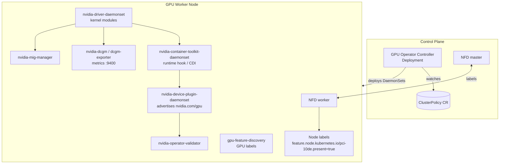
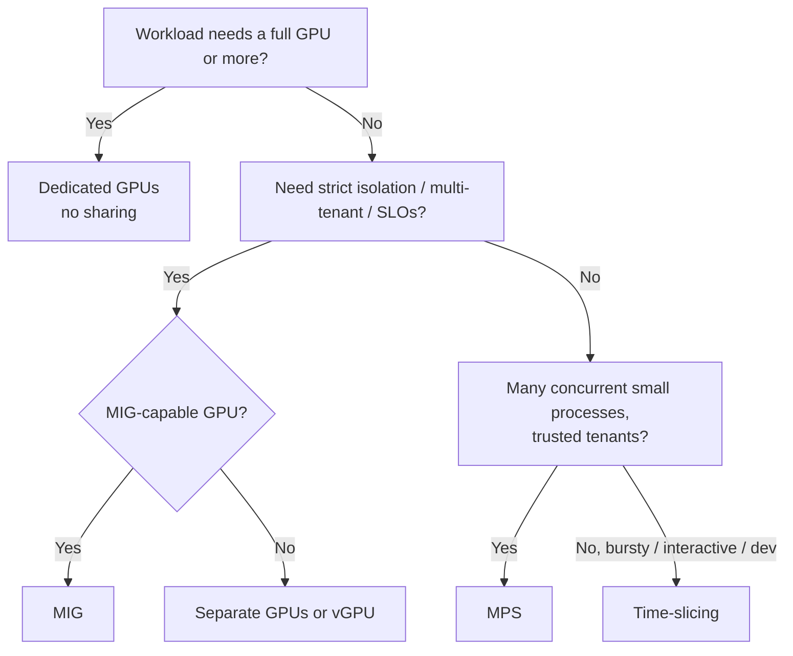

# NVIDIA GPU Operator on Kubernetes: The Complete Guide

**From the basics to advanced setup, performance tuning, and getting the most out of your GPUs**

> **Version note:** The GPU Operator, its components, and Kubernetes change quickly. The commands and values here follow current GPU Operator conventions (v24.x/v25.x). Before you run anything in production, check the exact chart version, the driver branch, and the support matrix in the [official docs](https://docs.nvidia.com/datacenter/cloud-native/gpu-operator/latest/index.html).

---

## Table of Contents

1. [Fundamentals: GPUs in Kubernetes](#1-fundamentals-gpus-in-kubernetes)
2. [What the GPU Operator Is and Why You Need It](#2-what-the-gpu-operator-is-and-why-you-need-it)
3. [Architecture and Components](#3-architecture-and-components)
4. [Prerequisites and Planning](#4-prerequisites-and-planning)
5. [Installation (Basic)](#5-installation-basic)
6. [Installation Scenarios (Intermediate)](#6-installation-scenarios-intermediate)
7. [Verifying the Installation](#7-verifying-the-installation)
8. [Scheduling GPU Workloads](#8-scheduling-gpu-workloads)
9. [GPU Sharing: Time-Slicing, MPS, MIG, vGPU](#9-gpu-sharing-time-slicing-mps-mig-vgpu)
10. [Dynamic Resource Allocation (DRA) for GPUs](#10-dynamic-resource-allocation-dra-for-gpus)
11. [Monitoring and Observability (DCGM)](#11-monitoring-and-observability-dcgm)
12. [Performance Optimization: Node and Hardware Level](#12-performance-optimization-node-and-hardware-level)
13. [Performance Optimization: Kubernetes Level](#13-performance-optimization-kubernetes-level)
14. [Performance Optimization: Networking and Multi-Node (RDMA, NCCL)](#14-performance-optimization-networking-and-multi-node-rdma-nccl)
15. [Performance Optimization: Storage and Data Pipelines](#15-performance-optimization-storage-and-data-pipelines)
16. [Performance Optimization: Application Level](#16-performance-optimization-application-level)
17. [Using GPUs Efficiently: Utilization, Quotas, Autoscaling, Cost](#17-using-gpus-efficiently-utilization-quotas-autoscaling-cost)
18. [Day-2 Operations: Upgrades, Health, Reliability](#18-day-2-operations-upgrades-health-reliability)
19. [Security Considerations](#19-security-considerations)
20. [Troubleshooting Playbook](#20-troubleshooting-playbook)
21. [Reference Architectures](#21-reference-architectures)
22. [Cheat Sheet and Checklists](#22-cheat-sheet-and-checklists)
23. [Further Reading](#23-further-reading)

---

## 1. Fundamentals: GPUs in Kubernetes

### 1.1 How Kubernetes sees hardware

Kubernetes natively schedules only **CPU**, **memory**, **ephemeral storage**, and **hugepages**. It knows nothing about GPUs. GPUs reach Kubernetes through two mechanisms:

| Mechanism | Description | Status |
|---|---|---|
| **Device Plugin framework** | A DaemonSet registers an *extended resource* (for example `nvidia.com/gpu`) with the kubelet over gRPC. The kubelet advertises an integer count, and the device plugin decides which devices a container gets. | Stable, the most widely used |
| **Dynamic Resource Allocation (DRA)** | A richer API with `ResourceClaim`, `DeviceClass`, and `ResourceSlice`. It supports attribute-based selection, sharing, and partitioning. | GA in Kubernetes 1.34 (`resource.k8s.io/v1`) |

### 1.2 What a container needs to use a GPU

For a containerized process to run CUDA code, all of the following must be in place:

1. **The NVIDIA kernel driver** (`nvidia.ko`, `nvidia-uvm.ko`, `nvidia-modeset.ko`, and optionally `nvidia-peermem.ko`) loaded on the host.
2. **Device nodes** (`/dev/nvidia0`, `/dev/nvidiactl`, `/dev/nvidia-uvm`, and so on) exposed inside the container.
3. **User-space driver libraries** (`libcuda.so`, `libnvidia-ml.so`, and so on) that match the kernel driver version, mounted into the container.
4. **A container runtime hook or CDI spec** (NVIDIA Container Toolkit) that injects items 2 and 3.
5. **A scheduler-visible resource** (from the device plugin or DRA) so pods land on GPU nodes.
6. **The CUDA runtime and your application** inside the container image (for example `nvidia/cuda:12.x-runtime`).

> **Key idea:** The container image ships the **CUDA toolkit/runtime**. The host provides the **driver**. A newer driver supports older CUDA runtimes (backward compatibility). Forward compatibility, where an older driver runs a newer CUDA, is possible only on datacenter GPUs with the `cuda-compat` package.

### 1.3 The manual way (and why it hurts)

Without the operator, you would have to do the following on every GPU node:

- Install the driver package that matches the kernel, and rebuild it on every kernel update.
- Install and configure the NVIDIA Container Toolkit for containerd or CRI-O.
- Deploy the device plugin DaemonSet.
- Deploy DCGM and the DCGM exporter for metrics.
- Deploy Node Feature Discovery and GPU Feature Discovery for labels.
- Configure MIG by hand.
- Coordinate driver upgrades with node drains.

The GPU Operator automates all of this.

---

## 2. What the GPU Operator Is and Why You Need It

The **NVIDIA GPU Operator** is a Kubernetes operator. It uses the operator pattern (a CRD plus a controller) to manage the full NVIDIA software stack on GPU nodes as **containers**. It is driven by a single custom resource, `ClusterPolicy` (plus an optional `NVIDIADriver` CR).

**Benefits:**

- **Immutable, uniform nodes:** You can use a stock OS image without baking drivers into it. The driver runs as a container.
- **Declarative:** The whole GPU stack is versioned in Helm values or a `ClusterPolicy`.
- **Automatic node onboarding:** When a GPU node joins, the operator detects it through NFD labels and deploys the stack.
- **Managed upgrades:** Rolling driver upgrades with cordon, drain, and validation.
- **Built-in observability:** DCGM exporter metrics are ready for Prometheus.
- **Advanced features:** MIG management, time-slicing, MPS, vGPU, GPUDirect RDMA, GPUDirect Storage, Kata/confidential containers.

---

## 3. Architecture and Components



### 3.1 Component reference

| Component | Kind | Purpose |
|---|---|---|
| **gpu-operator** | Deployment | Reconciles `ClusterPolicy` and creates and updates all the DaemonSets |
| **Node Feature Discovery (NFD)** | DaemonSet plus Deployment | Labels nodes with PCI vendor `10de` (NVIDIA), kernel version, and OS. The operator targets nodes labeled `feature.node.kubernetes.io/pci-10de.present=true` |
| **nvidia-driver-daemonset** | DaemonSet | Compiles or loads the NVIDIA kernel modules inside a privileged container and starts `nvidia-persistenced` |
| **nvidia-container-toolkit-daemonset** | DaemonSet | Installs the NVIDIA runtime and configures containerd or CRI-O (`nvidia` runtime class, CDI specs) |
| **nvidia-device-plugin-daemonset** | DaemonSet | Advertises `nvidia.com/gpu` (or MIG resources) to the kubelet and handles time-slicing and MPS config |
| **nvidia-device-plugin-mps-control-daemon** | DaemonSet | Runs the MPS control daemon when MPS sharing is enabled |
| **gpu-feature-discovery (GFD)** | DaemonSet | Adds `nvidia.com/gpu.*` labels: product, memory, count, MIG capability, CUDA version |
| **nvidia-dcgm** | DaemonSet | The Data Center GPU Manager host engine |
| **nvidia-dcgm-exporter** | DaemonSet | Exposes GPU metrics in Prometheus format on port 9400 |
| **nvidia-mig-manager** | DaemonSet | Applies MIG partition profiles from the `nvidia.com/mig.config` node label |
| **nvidia-operator-validator** | DaemonSet | Validates the driver, toolkit, CUDA, and plugin, and gates the other components |
| **nvidia-node-status-exporter** | DaemonSet | Exports operator health metrics |
| **nvidia-peermem / GDRCopy / nvidia-fs** | Driver sidecars | GPUDirect RDMA and GPUDirect Storage support |
| **sandbox-device-plugin, vfio-manager, vgpu-manager** | DaemonSets | GPU passthrough and vGPU for KubeVirt and Kata workloads |

### 3.2 Startup order (dependency chain)

```
NFD labels node
   └─> driver loads kernel modules  (driver-validation)
         └─> toolkit configures runtime (toolkit-validation)
               └─> CUDA sample runs     (cuda-validation)
                     └─> device plugin registers resources (plugin-validation)
                           └─> GFD, DCGM, DCGM-exporter, MIG manager start
```

Each stage waits on files in `/run/nvidia/validations/` that the validator writes. This is why a broken driver blocks everything downstream. It is also the first place to look when you troubleshoot.

### 3.3 Node workload modes

The `nvidia.com/gpu.workload.config` node label selects what gets deployed on a node:

| Value | Use |
|---|---|
| `container` (default) | Normal containers with the device plugin |
| `vm-passthrough` | KubeVirt or Kata with the full GPU passed through via VFIO |
| `vm-vgpu` | KubeVirt with NVIDIA vGPU |

---

## 4. Prerequisites and Planning

### 4.1 Checklist

- [ ] **Supported GPU:** A data center GPU (A100, H100, H200, B200, GB200, L40S, L4, A10, T4, V100, and others). Consumer GeForce cards often work for development but are not officially supported.
- [ ] **Supported OS:** Ubuntu 20.04, 22.04, or 24.04, RHEL/Rocky 8.x or 9.x, Red Hat CoreOS (OpenShift). Check the support matrix for your operator version.
- [ ] **Kubernetes:** A version within the operator's supported range. Containerd 1.6+ or CRI-O.
- [ ] **No pre-installed driver** on the node, **or** set `driver.enabled=false` if one is already there.
- [ ] **Nouveau driver disabled.** The driver container handles this, but check if it fails.
- [ ] **Secure Boot:** Either disabled, or use precompiled/signed drivers. Unsigned kernel modules will not load under Secure Boot.
- [ ] **Kernel headers available.** The driver container needs matching headers, or use precompiled driver images.
- [ ] **Internet access** to `nvcr.io` and OS package repositories, **or** a mirrored registry for air-gapped setups.
- [ ] **Pod Security:** The `gpu-operator` namespace needs `privileged` pod security admission.
- [ ] **Helm 3** installed.

### 4.2 Decide up front

| Decision | Options | Guidance |
|---|---|---|
| Driver management | Operator-managed (container) vs. host-installed | Use operator-managed for uniform fleets. Use host-installed for managed clouds whose node images already have drivers (GKE COS, some EKS AMIs) |
| Driver type | Default (compiled on node), precompiled, open kernel modules | Use **open kernel modules** (`driver.kernelModuleType=open`) for Hopper, Blackwell, and newer. They are required on Blackwell |
| Runtime injection | Legacy runtime hook vs. **CDI** | Prefer CDI (`cdi.enabled=true`). It is cleaner and the future direction |
| Sharing | None, time-slicing, MPS, MIG, vGPU | See [Section 9](#9-gpu-sharing-time-slicing-mps-mig-vgpu) |
| Allocation API | Device plugin vs. DRA | Use the device plugin for simplicity. Use DRA for advanced selection and partitioning |
| Networking | Ethernet vs. InfiniBand/RoCE with GPUDirect RDMA | Multi-node training needs RDMA. Pair with the NVIDIA Network Operator |

### 4.3 Check the hardware first

```bash
# On the node
lspci | grep -i nvidia
uname -r
cat /etc/os-release
mokutil --sb-state          # Secure Boot status
lsmod | grep -E 'nouveau|nvidia'
```

---

## 5. Installation (Basic)

### 5.1 Add the Helm repo

```bash
helm repo add nvidia https://helm.ngc.nvidia.com/nvidia
helm repo update
helm search repo nvidia/gpu-operator --versions | head
```

### 5.2 Create the namespace with privileged pod security

```bash
kubectl create ns gpu-operator
kubectl label --overwrite ns gpu-operator pod-security.kubernetes.io/enforce=privileged
```

### 5.3 Install with defaults

```bash
helm install gpu-operator nvidia/gpu-operator \
  -n gpu-operator \
  --version=<chart-version> \
  --wait
```

This deploys NFD, the driver, the toolkit, the device plugin, GFD, DCGM, the DCGM exporter, the MIG manager, and the validator.

> If NFD already runs in your cluster, add `--set nfd.enabled=false` to avoid running two copies.

### 5.4 Watch it come up

```bash
kubectl get pods -n gpu-operator -w
```

Expected final state (names vary):

```
gpu-feature-discovery-xxxxx                    1/1  Running
gpu-operator-xxxxxxxxxx-xxxxx                  1/1  Running
nvidia-container-toolkit-daemonset-xxxxx       1/1  Running
nvidia-cuda-validator-xxxxx                    0/1  Completed
nvidia-dcgm-exporter-xxxxx                     1/1  Running
nvidia-device-plugin-daemonset-xxxxx           1/1  Running
nvidia-driver-daemonset-xxxxx                  1/1  Running
nvidia-operator-validator-xxxxx                1/1  Running
```

The first install takes about 5 to 10 minutes per node because the driver container compiles kernel modules.

---

## 6. Installation Scenarios (Intermediate)

### 6.1 A production-style `values.yaml`

```yaml
# values-prod.yaml
operator:
  defaultRuntime: containerd

nfd:
  enabled: true

driver:
  enabled: true
  version: "<driver-version>"        # pin it, e.g. a production branch (R550 / R570 / R580)
  kernelModuleType: auto              # auto | open | proprietary
  rdma:
    enabled: false                    # true for GPUDirect RDMA (with Network Operator)
  upgradePolicy:
    autoUpgrade: true
    maxParallelUpgrades: 1
    maxUnavailable: 25%
    drain:
      enable: true
      force: false
      deleteEmptyDir: true
      timeoutSeconds: 300
    gpuPodDeletion:
      force: false
      deleteEmptyDir: true
      timeoutSeconds: 300
    waitForCompletion:
      timeoutSeconds: 0
      podSelector: ""                 # e.g. "app=training" to wait for jobs to finish

toolkit:
  enabled: true

cdi:
  enabled: true
  default: false

devicePlugin:
  enabled: true
  config:
    name: ""                          # ConfigMap for time-slicing/MPS (Section 9)
    default: ""

mig:
  strategy: single                    # single | mixed

migManager:
  enabled: true

dcgm:
  enabled: true

dcgmExporter:
  enabled: true
  serviceMonitor:
    enabled: true                     # requires Prometheus Operator CRDs
    interval: 15s

gfd:
  enabled: true

validator:
  plugin:
    env:
      - name: WITH_WORKLOAD
        value: "false"

# Keep operator components off non-GPU nodes and tolerate GPU taints
daemonsets:
  tolerations:
    - key: nvidia.com/gpu
      operator: Exists
      effect: NoSchedule
  priorityClassName: system-node-critical
```

```bash
helm upgrade --install gpu-operator nvidia/gpu-operator \
  -n gpu-operator --version=<chart-version> -f values-prod.yaml --wait
```

### 6.2 Drivers already installed on the host

```bash
helm install gpu-operator nvidia/gpu-operator -n gpu-operator \
  --set driver.enabled=false
```

If the Container Toolkit is also pre-installed on the host, add `--set toolkit.enabled=false`.

### 6.3 Precompiled drivers (faster, Secure Boot friendly)

```bash
--set driver.usePrecompiled=true \
--set driver.version="<driver-branch, e.g. 550>"
```

Precompiled images exist only for specific kernel flavors (mainly Ubuntu). They skip on-node compilation, so nodes come up in seconds rather than minutes.

### 6.4 Per-node-pool drivers with the `NVIDIADriver` CRD

You can run different driver versions or types on different node pools, for example a stable branch on inference nodes and a new branch on training nodes.

```bash
helm install gpu-operator nvidia/gpu-operator -n gpu-operator \
  --set driver.nvidiaDriverCRD.enabled=true \
  --set driver.nvidiaDriverCRD.deployDefaultCR=false
```

```yaml
apiVersion: nvidia.com/v1alpha1
kind: NVIDIADriver
metadata:
  name: h100-training
spec:
  driverType: gpu
  kernelModuleType: open
  version: "<driver-version>"
  repository: nvcr.io/nvidia
  image: driver
  nodeSelector:
    nvidia.com/gpu.product: NVIDIA-H100-80GB-HBM3
---
apiVersion: nvidia.com/v1alpha1
kind: NVIDIADriver
metadata:
  name: l4-inference
spec:
  driverType: gpu
  version: "<other-driver-version>"
  repository: nvcr.io/nvidia
  image: driver
  nodeSelector:
    nvidia.com/gpu.product: NVIDIA-L4
```

> The node selectors of different `NVIDIADriver` CRs must not overlap.

### 6.5 Containerd variants (k3s, RKE2, MicroK8s)

These distributions keep containerd config in non-standard paths:

```yaml
toolkit:
  env:
    - name: CONTAINERD_CONFIG
      value: /var/lib/rancher/rke2/agent/etc/containerd/config.toml.tmpl   # RKE2
    - name: CONTAINERD_SOCKET
      value: /run/k3s/containerd/containerd.sock
    - name: CONTAINERD_RUNTIME_CLASS
      value: nvidia
    - name: CONTAINERD_SET_AS_DEFAULT
      value: "true"
```

For k3s the config is `/var/lib/rancher/k3s/agent/etc/containerd/config.toml.tmpl`. Recent operator versions also support containerd drop-in config files.

### 6.6 Managed clouds

| Platform | Notes |
|---|---|
| **AWS EKS** | EKS GPU AMIs (AL2023 NVIDIA, Bottlerocket NVIDIA) ship with drivers, so use `driver.enabled=false` and often `toolkit.enabled=false`. With a plain Ubuntu AMI, use the full operator |
| **GKE** | GKE can install drivers itself (`gpu-driver-version=latest` on the node pool). If you use the operator, set `driver.enabled=false` and `toolkit.enabled=false` and use GKE's device plugin, **or** create node pools with `gpu-driver-version=disabled` and Ubuntu images and let the operator manage everything. Don't mix the two approaches |
| **AKS** | Create GPU node pools with `--skip-gpu-driver-install` (or the equivalent option in current AKS), then install the full operator |
| **OpenShift** | Install NFD and the GPU Operator from OperatorHub. Drivers are built against RHCOS via the Driver Toolkit, and entitlement is not needed on modern OCP |

### 6.7 Air-gapped / disconnected clusters

1. Mirror all images (operator, driver for each OS and kernel, toolkit, device plugin, DCGM, exporter, validator, NFD, MIG manager) to an internal registry.
2. Set `--set operator.repository=...`, `driver.repository=...`, and so on, or use a global registry override.
3. For on-node driver compilation, provide a **local package repository** via a ConfigMap (`driver.repoConfig.configMapName`), or use precompiled drivers.
4. Provide custom CA certificates via `driver.certConfig.name` if your mirror uses a private CA.

### 6.8 Proxy environments

```yaml
driver:
  env:
    - name: HTTPS_PROXY
      value: http://proxy.example.com:3128
    - name: HTTP_PROXY
      value: http://proxy.example.com:3128
    - name: NO_PROXY
      value: .svc,.cluster.local,10.0.0.0/8
```

---

## 7. Verifying the Installation

### 7.1 Check node resources and labels

```bash
kubectl get nodes -o custom-columns=NAME:.metadata.name,GPU:.status.allocatable.'nvidia\.com/gpu'
kubectl get node <node> --show-labels | tr ',' '\n' | grep nvidia.com
```

Important GFD labels:

```
nvidia.com/gpu.present=true
nvidia.com/gpu.product=NVIDIA-H100-80GB-HBM3
nvidia.com/gpu.memory=81559
nvidia.com/gpu.count=8
nvidia.com/gpu.family=hopper
nvidia.com/gpu.compute.major=9
nvidia.com/cuda.driver.major=12
nvidia.com/mig.capable=true
nvidia.com/gpu.replicas=1
nvidia.com/gpu.sharing-strategy=none
nvidia.com/gpu.deploy.driver=true
```

### 7.2 Run a CUDA test pod

```yaml
apiVersion: v1
kind: Pod
metadata:
  name: cuda-vectoradd
spec:
  restartPolicy: OnFailure
  containers:
    - name: cuda-vectoradd
      image: nvcr.io/nvidia/k8s/cuda-sample:vectoradd-cuda12.5.0
      resources:
        limits:
          nvidia.com/gpu: 1
```

```bash
kubectl apply -f cuda-vectoradd.yaml
kubectl logs cuda-vectoradd
# [Vector addition of 50000 elements] ... Test PASSED
```

### 7.3 Run nvidia-smi from inside the driver container

```bash
kubectl exec -n gpu-operator -it ds/nvidia-driver-daemonset -- nvidia-smi
kubectl exec -n gpu-operator -it ds/nvidia-driver-daemonset -- nvidia-smi topo -m
```

### 7.4 Check ClusterPolicy status

```bash
kubectl get clusterpolicies.nvidia.com cluster-policy -o jsonpath='{.status.state}'
# ready
```

---

## 8. Scheduling GPU Workloads

### 8.1 Requesting GPUs

```yaml
resources:
  limits:
    nvidia.com/gpu: 2      # GPUs go in limits; requests default to limits
```

Rules:

- GPUs are **integers** under the device plugin. There are no fractional GPUs unless you use sharing (Section 9).
- GPUs are **not overcommitted**. Each allocated GPU is exclusive to the container unless sharing is configured.
- If you specify both, `requests` must equal `limits` for extended resources.

### 8.2 Steering pods to the right GPU

```yaml
spec:
  nodeSelector:
    nvidia.com/gpu.product: NVIDIA-A100-SXM4-80GB
  # or with affinity for flexibility:
  affinity:
    nodeAffinity:
      requiredDuringSchedulingIgnoredDuringExecution:
        nodeSelectorTerms:
          - matchExpressions:
              - key: nvidia.com/gpu.memory
                operator: Gt
                values: ["40000"]
```

### 8.3 Keeping non-GPU pods off GPU nodes

Taint the GPU nodes:

```bash
kubectl taint nodes <gpu-node> nvidia.com/gpu=present:NoSchedule
```

GPU pods then tolerate the taint:

```yaml
tolerations:
  - key: nvidia.com/gpu
    operator: Exists
    effect: NoSchedule
```

> **Tip:** Enable the **`ExtendedResourceToleration`** admission plugin on the API server. It automatically adds the toleration to any pod that requests `nvidia.com/gpu`.

### 8.4 Avoid this common mistake

**Don't** set `NVIDIA_VISIBLE_DEVICES=all` in images or pod specs to get around the scheduler. The pod would see every GPU on the node, including GPUs allocated to other pods. The device plugin sets this variable (or CDI devices) correctly. Recent toolkit versions ignore the env var from unprivileged containers when `accept-nvidia-visible-devices-envvar-when-unprivileged=false` is configured, which is the recommended hardening.

---

## 9. GPU Sharing: Time-Slicing, MPS, MIG, vGPU

One of the biggest sources of waste is giving a whole 80 GB GPU to a workload that uses 5% of it. Kubernetes offers several sharing strategies.

### 9.1 Comparison

| Feature | Time-Slicing | MPS | MIG | vGPU |
|---|---|---|---|---|
| Isolation (memory) | ❌ None | ⚠️ Limits can be set, no hard fault isolation | ✅ Hardware | ✅ Hypervisor |
| Isolation (fault) | ❌ | ❌ (one client fault can affect others) | ✅ | ✅ |
| Isolation (compute) | Temporal (context switch) | Spatial (concurrent SMs) | Hardware (dedicated SMs) | Temporal/hypervisor |
| Concurrency | Sequential slices | **True concurrency** | True concurrency | Time-sliced |
| Performance overhead | Context-switch overhead | Low | ~None | Low to moderate |
| GPU support | All | Volta+ | A100, A30, H100, H200, B200, GB200, RTX Pro 6000 Blackwell, and others | Licensed vGPU GPUs |
| Reconfiguration | ConfigMap | ConfigMap | Node label (requires GPU idle) | VM profile |
| Best for | Dev/test, notebooks, bursty light inference | Many small inference processes, HPC with many small kernels | Multi-tenant production, guaranteed QoS | VMs, VDI |

### 9.2 Time-slicing

The device plugin advertises `N` replicas of each GPU. Pods share the GPU by time-multiplexing.

```yaml
apiVersion: v1
kind: ConfigMap
metadata:
  name: time-slicing-config
  namespace: gpu-operator
data:
  any: |-
    version: v1
    flags:
      migStrategy: none
    sharing:
      timeSlicing:
        renameByDefault: false      # true => resource becomes nvidia.com/gpu.shared
        failRequestsGreaterThanOne: true
        resources:
          - name: nvidia.com/gpu
            replicas: 4
  # A second profile, selectable per node:
  l4-heavy: |-
    version: v1
    sharing:
      timeSlicing:
        resources:
          - name: nvidia.com/gpu
            replicas: 8
```

```bash
kubectl apply -f time-slicing-config.yaml

# Cluster-wide default profile
kubectl patch clusterpolicies.nvidia.com/cluster-policy --type merge \
  -p '{"spec":{"devicePlugin":{"config":{"name":"time-slicing-config","default":"any"}}}}'

# Override per node
kubectl label node <node> nvidia.com/device-plugin.config=l4-heavy --overwrite
```

Result: a node with 1 GPU now reports `nvidia.com/gpu: 4`, and GFD sets `nvidia.com/gpu.replicas=4` and `nvidia.com/gpu.product=<name>-SHARED`.

**Caveats:**

- There is **no memory isolation**. One pod can allocate all the VRAM and cause OOM errors in the others. Applications must limit their own memory (for example the PyTorch `torch.cuda.set_per_process_memory_fraction`, the vLLM `--gpu-memory-utilization`, or the TF `allow_growth`).
- Requesting `nvidia.com/gpu: 2` gives you 2 *replicas*. They may be on the **same** physical GPU, so this gives no extra compute. Use `failRequestsGreaterThanOne: true` to prevent this.
- Context switching adds overhead. Utilization looks high, but per-job throughput drops.

### 9.3 MPS (Multi-Process Service)

MPS lets kernels from multiple processes run **concurrently** on one GPU, with each process limited to a share of the SMs and memory. The device plugin (v0.15+) runs an MPS control daemon for you.

```yaml
apiVersion: v1
kind: ConfigMap
metadata:
  name: mps-config
  namespace: gpu-operator
data:
  any: |-
    version: v1
    sharing:
      mps:
        renameByDefault: false
        resources:
          - name: nvidia.com/gpu
            replicas: 4          # each client gets ~1/4 of SMs and memory
```

```bash
kubectl patch clusterpolicies.nvidia.com/cluster-policy --type merge \
  -p '{"spec":{"devicePlugin":{"config":{"name":"mps-config","default":"any"}}}}'
```

**When MPS beats time-slicing:** Many small inference processes that each underuse SMs. With MPS they overlap instead of taking turns, which often gives 2 to 4 times the aggregate throughput.

**Caveats:** A fatal error in one client can affect all clients on that GPU. MPS cannot be combined with MIG on the same GPU through the device plugin.

### 9.4 MIG (Multi-Instance GPU)

MIG partitions a GPU **in hardware** into up to 7 instances. Each instance has dedicated SMs, L2 cache slices, memory controllers, and memory, giving strong isolation and predictable performance.

**Example A100 80GB / H100 80GB profiles:**

| Profile | Compute slices | Memory | Max instances |
|---|---|---|---|
| `1g.10gb` | 1/7 | 10 GB | 7 |
| `1g.20gb` | 1/7 | 20 GB | 4 |
| `2g.20gb` | 2/7 | 20 GB | 3 |
| `3g.40gb` | 3/7 | 40 GB | 2 |
| `4g.40gb` | 4/7 | 40 GB | 1 |
| `7g.80gb` | 7/7 | 80 GB | 1 |

(H100 also has `1g.10gb+me` with a media engine. H200, B200, and A100 40GB use different memory sizes. Run `nvidia-smi mig -lgip` on the node to see the exact profiles.)

#### Strategies

- **`single`:** All GPUs on a node use the same profile. The resource stays `nvidia.com/gpu`, so existing pod specs work unchanged.
- **`mixed`:** Different profiles on the same node or GPU. Resources are named `nvidia.com/mig-1g.10gb`, `nvidia.com/mig-3g.40gb`, and so on.

```bash
helm upgrade gpu-operator nvidia/gpu-operator -n gpu-operator --reuse-values \
  --set mig.strategy=mixed
```

#### Applying a MIG layout

The MIG manager watches the `nvidia.com/mig.config` label:

```bash
# All GPUs -> 7 x 1g.10gb
kubectl label node <node> nvidia.com/mig.config=all-1g.10gb --overwrite

# A balanced built-in mix
kubectl label node <node> nvidia.com/mig.config=all-balanced --overwrite

# Watch progress
kubectl get node <node> -o jsonpath='{.metadata.labels.nvidia\.com/mig\.config\.state}'
# pending -> success
```

> The MIG manager stops GPU clients (device plugin, DCGM, and so on) while it reconfigures. **Drain GPU workloads first.** Some GPUs or clouds also require a GPU reset or node reboot to enable MIG mode.

#### Custom MIG profiles

```yaml
apiVersion: v1
kind: ConfigMap
metadata:
  name: custom-mig-config
  namespace: gpu-operator
data:
  config.yaml: |
    version: v1
    mig-configs:
      all-disabled:
        - devices: all
          mig-enabled: false
      # GPUs 0-3 for inference (small slices), 4-7 for training (whole GPU)
      inference-training-split:
        - devices: [0,1,2,3]
          mig-enabled: true
          mig-devices:
            "1g.10gb": 3
            "2g.20gb": 2
        - devices: [4,5,6,7]
          mig-enabled: false
```

```bash
kubectl patch clusterpolicies.nvidia.com/cluster-policy --type merge \
  -p '{"spec":{"migManager":{"config":{"name":"custom-mig-config"}}}}'
kubectl label node <node> nvidia.com/mig.config=inference-training-split --overwrite
```

Requesting a slice (mixed strategy):

```yaml
resources:
  limits:
    nvidia.com/mig-2g.20gb: 1
```

#### MIG plus time-slicing

You can time-slice MIG instances. For example, 7 × `1g.10gb` instances × 2 replicas gives 14 schedulable units per GPU, which suits very light notebook workloads.

```yaml
sharing:
  timeSlicing:
    resources:
      - name: nvidia.com/mig-1g.10gb
        replicas: 2
```

### 9.5 vGPU and VM passthrough

For KubeVirt VMs, label the node `nvidia.com/gpu.workload.config=vm-vgpu` or `vm-passthrough`, and enable `sandboxWorkloads.enabled=true`. The operator then deploys the vGPU manager or VFIO manager plus the sandbox device plugin. vGPU requires an NVIDIA AI Enterprise / vGPU license and a license server (DLS/CLS) configured via `driver.licensingConfig`.

### 9.6 Choosing a sharing strategy



---

## 10. Dynamic Resource Allocation (DRA) for GPUs

DRA (`resource.k8s.io/v1`, GA in Kubernetes 1.34) replaces "count of opaque devices" with **claims over devices that have attributes**. NVIDIA provides the **NVIDIA DRA Driver for GPUs** (`k8s-dra-driver-gpu`), which the GPU Operator can deploy alongside or instead of the device plugin.

### 10.1 What DRA adds

- Select GPUs by **attributes** using CEL, for example memory ≥ 40Gi, a specific architecture, or a driver version.
- **Shared claims:** Multiple pods or containers can reference the same `ResourceClaim`, so they share one GPU explicitly.
- **Dynamic MIG** and partitioning without pre-labeling nodes (driver feature, check maturity).
- **ComputeDomains** for multi-node NVLink (GB200 NVL72): IMEX channels are managed for you.
- **Admin access** and device health status reporting.

### 10.2 Example

```yaml
apiVersion: resource.k8s.io/v1
kind: ResourceClaimTemplate
metadata:
  name: big-gpu
spec:
  spec:
    devices:
      requests:
        - name: gpu
          exactly:
            deviceClassName: gpu.nvidia.com
            selectors:
              - cel:
                  expression: |
                    device.capacity['gpu.nvidia.com'].memory.compareTo(quantity('40Gi')) >= 0
---
apiVersion: v1
kind: Pod
metadata:
  name: dra-gpu-pod
spec:
  resourceClaims:
    - name: gpu
      resourceClaimTemplateName: big-gpu
  containers:
    - name: app
      image: nvcr.io/nvidia/cuda:12.6.0-base-ubuntu22.04
      command: ["nvidia-smi", "-L"]
      resources:
        claims:
          - name: gpu
```

### 10.3 Two containers sharing one GPU

```yaml
apiVersion: resource.k8s.io/v1
kind: ResourceClaim
metadata:
  name: shared-gpu
spec:
  devices:
    requests:
      - name: gpu
        exactly:
          deviceClassName: gpu.nvidia.com
---
# Pods A and B both reference resourceClaimName: shared-gpu
spec:
  resourceClaims:
    - name: gpu
      resourceClaimName: shared-gpu
```

> **Device plugin or DRA?** Use the device plugin today for simple, stable fleets. Adopt DRA when you need attribute-based selection, explicit sharing, or GB200 ComputeDomains. Don't advertise the same GPUs through both on the same node.

---

## 11. Monitoring and Observability (DCGM)

You can't optimize what you don't measure. The **DCGM exporter** is the foundation.

### 11.1 Wire it into Prometheus

With kube-prometheus-stack installed:

```bash
helm upgrade gpu-operator nvidia/gpu-operator -n gpu-operator --reuse-values \
  --set dcgmExporter.serviceMonitor.enabled=true
```

If Prometheus selects ServiceMonitors by label, add `dcgmExporter.serviceMonitor.additionalLabels.release=<prometheus-release>`.

Import the official **NVIDIA DCGM Exporter Grafana dashboard** (Grafana ID **12239**).

### 11.2 The metrics that actually matter

| Metric | What it tells you | Watch for |
|---|---|---|
| `DCGM_FI_DEV_GPU_UTIL` | % of time **any** kernel was running | A **coarse** metric. 100% can still mean poor use of the hardware |
| `DCGM_FI_PROF_GR_ENGINE_ACTIVE` | Graphics/compute engine active ratio | A more accurate version of "busy" |
| `DCGM_FI_PROF_SM_ACTIVE` | Fraction of SMs with at least one warp resident | Low = kernels too small or poor parallelism |
| `DCGM_FI_PROF_SM_OCCUPANCY` | Warps resident relative to the maximum | Low = register or shared memory pressure, small blocks |
| `DCGM_FI_PROF_PIPE_TENSOR_ACTIVE` | Tensor Core usage | Near 0 on DL training = not using mixed precision |
| `DCGM_FI_PROF_DRAM_ACTIVE` | Memory bandwidth usage | High = memory bound |
| `DCGM_FI_DEV_FB_USED` / `FB_FREE` | VRAM usage | Over-provisioned GPUs, OOM risk |
| `DCGM_FI_PROF_PCIE_TX/RX_BYTES` | Host-device transfer | High = data loading bottleneck |
| `DCGM_FI_PROF_NVLINK_TX/RX_BYTES` | GPU-to-GPU traffic | Collective communication health |
| `DCGM_FI_DEV_POWER_USAGE` | Watts | Power capping, efficiency |
| `DCGM_FI_DEV_GPU_TEMP`, `DCGM_FI_DEV_MEMORY_TEMP` | Temperature | Thermal throttling |
| `DCGM_FI_DEV_CLOCK_THROTTLE_REASONS` (or `CLOCKS_EVENT_REASONS`) | Why clocks dropped | Power, thermal, or sync boost |
| `DCGM_FI_DEV_XID_ERRORS` | Last XID error code | Hardware or driver faults |
| `DCGM_FI_DEV_ECC_DBE_VOL_TOTAL` | Double-bit ECC errors | Failing memory, so retire the GPU |
| `DCGM_FI_DEV_ROW_REMAP_FAILURE` | Row remapping failed | Needs RMA |

> **`GPU_UTIL` lies.** A tiny kernel running nonstop shows 100% utilization while using 1 of 132 SMs. Use **SM_ACTIVE**, **SM_OCCUPANCY**, and **PIPE_TENSOR_ACTIVE** to judge real efficiency.

### 11.3 Enabling profiling metrics

The `DCGM_FI_PROF_*` metrics may not be in the default CSV. Provide a custom metrics file:

```yaml
apiVersion: v1
kind: ConfigMap
metadata:
  name: dcgm-metrics
  namespace: gpu-operator
data:
  dcgm-metrics.csv: |
    DCGM_FI_DEV_GPU_UTIL,           gauge, GPU utilization (%)
    DCGM_FI_DEV_FB_USED,            gauge, Framebuffer used (MiB)
    DCGM_FI_DEV_FB_FREE,            gauge, Framebuffer free (MiB)
    DCGM_FI_DEV_POWER_USAGE,        gauge, Power (W)
    DCGM_FI_DEV_GPU_TEMP,           gauge, GPU temperature (C)
    DCGM_FI_DEV_SM_CLOCK,           gauge, SM clock (MHz)
    DCGM_FI_DEV_XID_ERRORS,         gauge, Last XID error
    DCGM_FI_DEV_ECC_DBE_VOL_TOTAL,  counter, Volatile DBE errors
    DCGM_FI_PROF_GR_ENGINE_ACTIVE,  gauge, Graphics engine active ratio
    DCGM_FI_PROF_SM_ACTIVE,         gauge, SM active ratio
    DCGM_FI_PROF_SM_OCCUPANCY,      gauge, SM occupancy ratio
    DCGM_FI_PROF_PIPE_TENSOR_ACTIVE,gauge, Tensor pipe active ratio
    DCGM_FI_PROF_DRAM_ACTIVE,       gauge, DRAM active ratio
    DCGM_FI_PROF_PCIE_TX_BYTES,     gauge, PCIe TX bytes/s
    DCGM_FI_PROF_PCIE_RX_BYTES,     gauge, PCIe RX bytes/s
    DCGM_FI_PROF_NVLINK_TX_BYTES,   gauge, NVLink TX bytes/s
    DCGM_FI_PROF_NVLINK_RX_BYTES,   gauge, NVLink RX bytes/s
```

```bash
kubectl apply -f dcgm-metrics.yaml
helm upgrade gpu-operator nvidia/gpu-operator -n gpu-operator --reuse-values \
  --set dcgmExporter.config.name=dcgm-metrics
```

### 11.4 Per-pod attribution

The DCGM exporter maps GPUs to pods via the kubelet pod-resources API, adding `pod`, `namespace`, and `container` labels. This enables per-team dashboards and chargeback. For MIG, metrics carry `GPU_I_PROFILE` and `GPU_I_ID` labels.

### 11.5 Useful PromQL

```promql
# Average real SM activity per namespace
avg by (namespace) (DCGM_FI_PROF_SM_ACTIVE{namespace!=""})

# Idle allocated GPUs (allocated to a pod but <5% busy for 1h) -> waste
avg_over_time(DCGM_FI_DEV_GPU_UTIL{pod!=""}[1h]) < 5

# Memory headroom per GPU (%)
100 * DCGM_FI_DEV_FB_USED / (DCGM_FI_DEV_FB_USED + DCGM_FI_DEV_FB_FREE)

# Tensor Core usage on training jobs
avg by (pod) (DCGM_FI_PROF_PIPE_TENSOR_ACTIVE{namespace="training"})

# Cluster-wide allocation ratio (needs kube-state-metrics)
sum(kube_pod_container_resource_requests{resource="nvidia_com_gpu"})
  / sum(kube_node_status_allocatable{resource="nvidia_com_gpu"})
```

### 11.6 Alerts to have

```yaml
groups:
  - name: gpu.rules
    rules:
      - alert: GPUXidError
        expr: DCGM_FI_DEV_XID_ERRORS > 0
        for: 1m
        labels: {severity: critical}
        annotations:
          summary: "XID {{ $value }} on {{ $labels.Hostname }} GPU {{ $labels.gpu }}"
      - alert: GPUDoubleBitECC
        expr: increase(DCGM_FI_DEV_ECC_DBE_VOL_TOTAL[10m]) > 0
        labels: {severity: critical}
      - alert: GPUHighTemp
        expr: DCGM_FI_DEV_GPU_TEMP > 85
        for: 5m
        labels: {severity: warning}
      - alert: GPUAllocatedButIdle
        expr: avg_over_time(DCGM_FI_DEV_GPU_UTIL{pod!=""}[2h]) < 5
        labels: {severity: info}
        annotations:
          summary: "Pod {{ $labels.namespace }}/{{ $labels.pod }} holds a GPU but is idle"
      - alert: GPUOperatorNotReady
        expr: gpu_operator_reconciliation_status == 0
        for: 15m
        labels: {severity: warning}
```

---

## 12. Performance Optimization: Node and Hardware Level

### 12.1 Persistence mode

Without persistence mode, the driver tears down GPU state when the last client exits, which adds seconds of latency to every pod start. The operator's driver container runs `nvidia-persistenced`, so this is on by default. Verify it:

```bash
kubectl exec -n gpu-operator ds/nvidia-driver-daemonset -- nvidia-smi -q | grep -i persistence
```

### 12.2 Clocks and power

```bash
# Inspect throttling
nvidia-smi -q -d PERFORMANCE,CLOCK,POWER

# Lock graphics clocks for consistent latency (inference / benchmarking)
nvidia-smi -lgc <min>,<max>
nvidia-smi -rgc                 # reset

# Power cap (perf/watt optimization; often -10–20% power costs only a few % perf)
nvidia-smi -pl <watts>
```

- **For throughput or cost per token:** Try power capping. Many workloads are memory bound and lose little performance at lower power.
- **For latency-critical inference:** Lock the clocks to avoid ramp-up jitter.
- Apply these settings with a privileged DaemonSet or a node-tuning tool so they survive reboots. Use them carefully and document them.

### 12.3 Cooling and throttling

Check `DCGM_FI_DEV_CLOCK_THROTTLE_REASONS`. Constant `HW_SLOWDOWN`, `HW_THERMAL`, or `SW_THERMAL` events point to datacenter cooling or airflow problems. No software tuning fixes those.

### 12.4 ECC

Keep ECC **enabled** in production. Silent data corruption is far worse than the ~5–10% memory capacity and bandwidth cost on older GPUs. HBM GPUs have ECC with negligible overhead.

### 12.5 Topology awareness (PCIe, NVLink, NUMA)

```bash
nvidia-smi topo -m
```

```
        GPU0  GPU1  GPU2  GPU3  NIC0  CPU Affinity  NUMA Affinity
GPU0     X    NV18  NV18  NV18  PXB   0-55          0
GPU1    NV18   X    NV18  NV18  PXB   0-55          0
...
```

| Code | Meaning | Performance |
|---|---|---|
| `NV#` | NVLink (# of links) | Best |
| `PIX` | Same PCIe switch | Good |
| `PXB` | Multiple PCIe switches | OK |
| `PHB` | Through the CPU host bridge | Worse |
| `NODE` | Across PCIe host bridges within a NUMA node | Worse |
| `SYS` | Across NUMA nodes (QPI/UPI/xGMI) | Worst |

Goals:

- Multi-GPU jobs should get GPUs connected by **NVLink/NVSwitch**, or at least on the same PCIe switch.
- CPU threads and memory should be on the **same NUMA node** as the GPU.
- The RDMA NIC should be on the **same PCIe switch** as its GPU (`PIX`/`PXB`) for GPUDirect RDMA.

The NVIDIA device plugin prefers allocating topology-aligned GPU sets when a container asks for multiple GPUs. On NVSwitch systems (DGX/HGX) all GPUs are equal, so this matters mostly on PCIe servers.

### 12.6 Fabric Manager (NVSwitch systems)

HGX/DGX A100, H100, H200, and B200 systems with NVSwitch **require Fabric Manager**. The operator's driver container runs it automatically on these systems. If CUDA reports `system not yet initialized` (error 802), Fabric Manager isn't running or its version doesn't match the driver.

### 12.7 OS-level tuning

- **CPU governor:** Set to `performance`.
- **Transparent hugepages:** Settings vary by workload. Many ML stacks prefer `madvise`.
- **IOMMU:** Use `iommu=pt` (passthrough) for bare-metal performance with RDMA.
- **PCIe ACS:** Disable ACS on PCIe switches (or set it up correctly) for GPUDirect P2P/RDMA. Otherwise traffic goes through the root complex.
- **Kernel:** Use an LTS kernel that the driver branch supports.

---

## 13. Performance Optimization: Kubernetes Level

### 13.1 Guaranteed QoS plus CPU pinning plus NUMA alignment

The data loader, preprocessing, and Python overhead often starve the GPU. Pin CPUs and align them with the GPU's NUMA node.

**Kubelet configuration:**

```yaml
apiVersion: kubelet.config.k8s.io/v1beta1
kind: KubeletConfiguration
cpuManagerPolicy: static
cpuManagerPolicyOptions:
  full-pcpus-only: "true"            # whole physical cores, no SMT sibling sharing
memoryManagerPolicy: Static
topologyManagerPolicy: single-numa-node   # or "restricted" / "best-effort"
topologyManagerScope: pod
reservedSystemCPUs: "0-3"
reservedMemory:
  - numaNode: 0
    limits:
      memory: 2Gi
kubeReserved:
  cpu: "1"
  memory: 2Gi
systemReserved:
  cpu: "1"
  memory: 2Gi
```

The NVIDIA device plugin reports NUMA hints to the Topology Manager, so GPU, CPU, and memory are aligned.

> **`single-numa-node`** rejects pods that can't be aligned (`TopologyAffinityError`). On 8-GPU nodes spanning 2 NUMA nodes, an 8-GPU pod can't fit in one NUMA node. Use `restricted`/`best-effort`, or the `prefer-closest-numa-nodes` policy option, for large pods.

**Pod (Guaranteed QoS, integer CPUs):**

```yaml
resources:
  requests:
    cpu: "16"
    memory: 128Gi
    nvidia.com/gpu: 2
  limits:
    cpu: "16"
    memory: 128Gi
    nvidia.com/gpu: 2
```

### 13.2 Shared memory (`/dev/shm`)

PyTorch DataLoader workers and NCCL use `/dev/shm`. The container default is 64 MB, which causes `Bus error` crashes or slowdowns.

```yaml
volumes:
  - name: dshm
    emptyDir:
      medium: Memory
      sizeLimit: 32Gi
containers:
  - volumeMounts:
      - name: dshm
        mountPath: /dev/shm
```

### 13.3 Image pull time

GPU images are large (10–30 GB). Slow pulls waste expensive GPU time.

- Pre-pull images with a DaemonSet, or bake them into node images.
- Use a local registry mirror or a pull-through cache.
- Use lazy-loading snapshotters (**SOCI**, **stargz/eStargz**, **Nydus**).
- Keep images lean: use `-runtime` rather than `-devel` bases and multi-stage builds.
- Set `imagePullPolicy: IfNotPresent`.

### 13.4 Model loading time (inference cold starts)

- Cache model weights on node-local NVMe (hostPath or local PV), or use a shared read-only PVC.
- Use safetensors with memory-mapped loading.
- Consider tools such as NVIDIA Run:ai Model Streamer or similar streaming loaders.
- Keep a warm pool (a minimum number of replicas) for latency-sensitive services.

### 13.5 Gang scheduling for distributed jobs

Distributed training needs **all** workers at once. If you schedule them one by one, partial allocations can deadlock and leave GPUs idle. Use a gang-aware scheduler:

- **Kueue** (admits the whole workload or nothing; works with Job, JobSet, PyTorchJob, RayJob, and others)
- **Volcano** (PodGroup with `minMember`)
- **Kubernetes native gang scheduling** (the Workload API, alpha in recent releases)
- **NVIDIA KAI Scheduler** (open-sourced from Run:ai; GPU-aware, gang, fractional GPUs, hierarchical queues)

### 13.6 Topology-aware placement across nodes

For multi-node training, place workers on nodes under the **same leaf switch / rack / NVLink domain**:

- Kueue **Topology Aware Scheduling (TAS)** with node labels such as `cloud.provider.com/topology-block` and `.../topology-rack`.
- Pod affinity on rack or block labels.
- On GB200 NVL72, use DRA **ComputeDomains** so pods share one NVLink domain.

### 13.7 Bin-packing GPUs (reduce fragmentation)

The default scheduler **spreads** pods (`LeastAllocated`), which fragments GPUs. A cluster can end up with 16 free GPUs spread 2 per node, so an 8-GPU job can't fit. Configure a bin-packing profile:

```yaml
apiVersion: kubescheduler.config.k8s.io/v1
kind: KubeSchedulerConfiguration
profiles:
  - schedulerName: gpu-binpack
    pluginConfig:
      - name: NodeResourcesFit
        args:
          scoringStrategy:
            type: MostAllocated
            resources:
              - name: nvidia.com/gpu
                weight: 10
              - name: cpu
                weight: 1
              - name: memory
                weight: 1
```

GPU pods then set `schedulerName: gpu-binpack`. The KAI Scheduler and Volcano also offer bin-pack policies.

---

## 14. Performance Optimization: Networking and Multi-Node (RDMA, NCCL)

Multi-node training performance is often limited by the network, not the GPUs.

### 14.1 GPUDirect RDMA

GPUDirect RDMA lets the NIC read and write GPU memory directly, bypassing host memory and CPU copies.

**Stack:** NVIDIA Network Operator (MOFED/DOCA drivers, RDMA shared device plugin or SR-IOV, Multus, IPAM) plus the GPU Operator with RDMA enabled.

```bash
helm upgrade gpu-operator nvidia/gpu-operator -n gpu-operator --reuse-values \
  --set driver.rdma.enabled=true \
  --set driver.rdma.useHostMofed=false   # true if MOFED is installed on host
```

Recent setups can use **DMA-BUF** instead of `nvidia-peermem` (open kernel modules plus a recent kernel), which needs no extra kernel module.

**Pod with a secondary RDMA network:**

```yaml
metadata:
  annotations:
    k8s.v1.cni.cncf.io/networks: rdma-net-ipam
spec:
  containers:
    - name: trainer
      securityContext:
        capabilities:
          add: ["IPC_LOCK"]          # required for RDMA memory registration
      resources:
        limits:
          nvidia.com/gpu: 8
          rdma/rdma_shared_device_a: 1   # or nvidia.com/<sriov-resource>: 8
```

### 14.2 NCCL tuning

NCCL handles collectives (all-reduce, all-gather) for PyTorch DDP/FSDP, Megatron, DeepSpeed, and others.

```yaml
env:
  - name: NCCL_DEBUG
    value: INFO                  # verify transport: look for "NET/IB" and "GDRDMA"
  - name: NCCL_IB_HCA
    value: mlx5                  # which HCAs to use
  - name: NCCL_SOCKET_IFNAME
    value: eth0                  # bootstrap interface (not the RDMA one)
  - name: NCCL_NET_GDR_LEVEL
    value: PHB                   # allow GPUDirect RDMA up to this topology distance
  - name: NCCL_IB_GID_INDEX
    value: "3"                   # RoCEv2 typically
  - name: NCCL_CROSS_NIC
    value: "0"
  # Cloud specifics: AWS EFA uses aws-ofi-nccl plugin; GCP uses gIB / TCPXO plugins
```

**Validate with nccl-tests** before blaming the model code:

```bash
mpirun -np 16 -H node1:8,node2:8 \
  /opt/nccl-tests/build/all_reduce_perf -b 8 -e 8G -f 2 -g 1
```

Compare `busbw` against the theoretical number. For example, on 8×400 Gb/s NDR per node, expect roughly 350–380 GB/s bus bandwidth for large messages on well-tuned clusters. Numbers far below that point to configuration problems (GDR disabled, wrong HCA, PCIe topology, ACS).

### 14.3 Distributed training operators

| Tool | Use |
|---|---|
| **Kubeflow Trainer** (TrainJob, formerly Training Operator PyTorchJob) | PyTorch, DeepSpeed, JAX distributed jobs |
| **JobSet** | Generic multi-template distributed jobs (TPU/GPU) |
| **MPI Operator** | Horovod, MPI, nccl-tests |
| **KubeRay** | Ray Train, Ray Serve |
| **LeaderWorkerSet (LWS)** | Multi-node inference (for example vLLM/SGLang with tensor plus pipeline parallelism across nodes) |

---

## 15. Performance Optimization: Storage and Data Pipelines

GPUs waiting for data is the most common hidden bottleneck. Symptoms are low `SM_ACTIVE`, high CPU iowait, and sawtooth GPU utilization.

- **Local NVMe cache:** Stage datasets onto local NVMe (with an init container or a CSI cache driver).
- **Parallel file systems:** Lustre, GPFS, WEKA, VAST, or DDN for large-scale training, via their CSI drivers.
- **GPUDirect Storage (GDS):** A DMA path from NVMe/NFS-over-RDMA directly into GPU memory. Enable it with `--set gds.enabled=true` (deploys `nvidia-fs`). Apps use cuFile (for example via DALI or kvikio).
- **Data loader tuning:**
  - PyTorch: `num_workers` = roughly CPU cores ÷ GPUs, `pin_memory=True`, `persistent_workers=True`, `prefetch_factor=2..4`.
  - Do preprocessing (decode, augment) on the **GPU** with **NVIDIA DALI**.
  - Use sharded, sequential formats (WebDataset, TFRecord, MosaicML Streaming, Parquet) rather than millions of small files.
- **Checkpointing:** Use asynchronous or distributed checkpointing (PyTorch DCP, NeMo async checkpoints) so GPUs don't stall during saves.

---

## 16. Performance Optimization: Application Level

The biggest gains usually come from the workload itself.

### 16.1 Training

| Technique | Gain | Notes |
|---|---|---|
| **Mixed precision (BF16/FP16)** | 2–3× vs FP32 | Uses Tensor Cores. Check `PIPE_TENSOR_ACTIVE` |
| **FP8 (Hopper/Blackwell)** | Up to ~1.5–2× over BF16 | Transformer Engine. FP4/MXFP formats on Blackwell |
| **`torch.compile`** | 1.2–2× | Kernel fusion, fewer launches |
| **FlashAttention / SDPA** | Large for attention | Memory and speed |
| **Larger batch size** to fill VRAM | Higher utilization | Use gradient accumulation if memory bound |
| **Activation checkpointing** | Fits bigger models/batches | Trades compute for memory |
| **FSDP / ZeRO / tensor/pipeline parallel** | Scale beyond one GPU's memory | Megatron-Core, DeepSpeed, NeMo |
| **CUDA Graphs** | Reduces CPU launch overhead | Good for small, static-shaped steps |
| **Overlap comm/compute** | Hides NCCL time | Bucketed DDP, FSDP prefetch |
| **Fused optimizers** (`fused=True` AdamW, Apex) | 5–15% | Fewer kernels |

### 16.2 Inference

| Technique | Notes |
|---|---|
| **Optimized serving engines** | **vLLM**, **SGLang**, **TensorRT-LLM**, **NVIDIA Dynamo**, **Triton Inference Server**, **NVIDIA NIM** |
| **Continuous/in-flight batching** | Large throughput gain over static batching |
| **PagedAttention / KV-cache management** | Higher concurrency per GPU |
| **Quantization** (FP8, INT8, INT4 AWQ/GPTQ, NVFP4) | Smaller footprint, higher throughput, often fits on a cheaper GPU or MIG slice |
| **Speculative decoding** | Lower latency |
| **Disaggregated prefill/decode** | Dynamo, llm-d. Scales prefill and decode pools separately |
| **KV-cache-aware routing** | Gateway API Inference Extension, Dynamo router. Reuses the prefix cache |
| **TensorRT / ONNX Runtime with TRT EP** | For CV and classic DL models |
| **Dynamic batching in Triton** | `max_queue_delay_microseconds` tuned to the latency SLO |
| **Right-size the GPU** | A 7B INT4 model doesn't need an H100. L4, a MIG slice, or time-slicing may do |

### 16.3 Profiling tools

- **Nsight Systems** (`nsys`): timeline of CPU, GPU, NCCL, and data loading. Finds idle gaps.
- **Nsight Compute** (`ncu`): per-kernel analysis.
- **PyTorch Profiler** with TensorBoard.
- **DCGM profiling metrics** for continuous fleet-level monitoring (Section 11).

Run Nsight Systems in a pod:

```bash
nsys profile -o /results/profile --trace=cuda,nvtx,osrt,cudnn,cublas \
  --duration=60 python train.py
```

(Profiling counters may require `NVreg_RestrictProfilingToAdminUsers=0` in the driver module parameters, set through the driver's `kernelModuleConfig` ConfigMap, or the `SYS_ADMIN` capability.)

---

## 17. Using GPUs Efficiently: Utilization, Quotas, Autoscaling, Cost

Studies of real clusters often find **average GPU utilization below 30–40%**. Here's how to do better.

### 17.1 The waste taxonomy

| Waste type | Cause | Fix |
|---|---|---|
| **Idle allocated** | Notebooks or dev pods holding GPUs overnight | Idle culling, TTLs, time-slicing for dev |
| **Oversized allocation** | Small model on a big GPU | MIG, MPS, time-slicing, smaller GPU types |
| **Fragmentation** | Free GPUs spread across nodes | Bin-packing, defragmentation, gang scheduling |
| **Under-utilized while running** | Data loading, CPU bottleneck, no mixed precision | Sections 13–16 |
| **Queue starvation** | Static per-team allocations | Fair-share quotas with borrowing (Kueue / KAI) |
| **Overprovisioned capacity** | Fixed node pools sized for peak | Autoscaling, spot/preemptible capacity |
| **Slow startup** | Image pulls, model loading, driver install | Pre-pull, caching, precompiled drivers |

### 17.2 Quotas and fair sharing with Kueue

```yaml
apiVersion: kueue.x-k8s.io/v1beta1
kind: ResourceFlavor
metadata:
  name: h100
spec:
  nodeLabels:
    nvidia.com/gpu.product: NVIDIA-H100-80GB-HBM3
---
apiVersion: kueue.x-k8s.io/v1beta1
kind: ClusterQueue
metadata:
  name: team-a
spec:
  cohort: research          # queues in a cohort can borrow idle quota from each other
  namespaceSelector: {}
  preemption:
    reclaimWithinCohort: Any
    withinClusterQueue: LowerPriority
  resourceGroups:
    - coveredResources: ["cpu", "memory", "nvidia.com/gpu"]
      flavors:
        - name: h100
          resources:
            - name: cpu
              nominalQuota: 512
            - name: memory
              nominalQuota: 4Ti
            - name: nvidia.com/gpu
              nominalQuota: 32
              borrowingLimit: 32     # may borrow up to 32 idle GPUs from the cohort
---
apiVersion: kueue.x-k8s.io/v1beta1
kind: LocalQueue
metadata:
  name: team-a-queue
  namespace: team-a
spec:
  clusterQueue: team-a
```

Jobs opt in with the label `kueue.x-k8s.io/queue-name: team-a-queue`.

**Why this matters:** Guaranteed quotas plus **borrowing** keep idle GPUs working. When the owner team needs its quota back, borrowed workloads are preempted.

### 17.3 Priority and preemption

```yaml
apiVersion: scheduling.k8s.io/v1
kind: PriorityClass
metadata:
  name: inference-prod
value: 100000
---
apiVersion: scheduling.k8s.io/v1
kind: PriorityClass
metadata:
  name: training-preemptible
value: 1000
preemptionPolicy: PreemptLowerPriority
```

The pattern: production inference > scheduled training > opportunistic or batch jobs. Opportunistic jobs **must checkpoint often** so preemption is cheap.

### 17.4 Autoscaling

**Node autoscaling:**

- **Cluster Autoscaler:** Use separate GPU node groups, and allow scale-to-zero (on some clouds this needs node group tags like `k8s.io/cluster-autoscaler/node-template/resources/nvidia.com/gpu`).
- **Karpenter:** NodePools with GPU instance families, `consolidationPolicy: WhenEmptyOrUnderutilized`, and GPU taints.
- Scale-up takes several minutes (VM boot, driver, image pull). Precompiled drivers, driver-included AMIs, and image caching cut this down.

**Pod autoscaling for inference (KEDA on DCGM or engine metrics):**

```yaml
apiVersion: keda.sh/v1alpha1
kind: ScaledObject
metadata:
  name: llm-server
spec:
  scaleTargetRef:
    name: llm-server
  minReplicaCount: 1
  maxReplicaCount: 10
  triggers:
    - type: prometheus
      metadata:
        serverAddress: http://prometheus.monitoring:9090
        # Prefer queue depth / latency over GPU util for LLM serving
        query: sum(vllm:num_requests_waiting{model_name="llama"})
        threshold: "10"
```

> For LLM serving, scale on **request queue depth, KV-cache usage, or time-to-first-token**, not on `GPU_UTIL`. GPU utilization is nearly always high when a model is loaded and serving.

### 17.5 Idle detection and culling

- JupyterHub `jupyterhub-idle-culler`, or Kubeflow Notebooks culling.
- A custom controller or CronJob that finds pods with `avg_over_time(DCGM_FI_DEV_GPU_UTIL[2h]) < 5` and notifies or scales down.
- `activeDeadlineSeconds` and `ttlSecondsAfterFinished` on Jobs.

### 17.6 Cost levers

| Lever | Typical savings |
|---|---|
| Spot/preemptible GPUs for checkpointed training and batch inference | 50–90% |
| Right-sizing GPU type (L4/L40S vs H100 for inference) | 2–5× cost per token for small models |
| MIG or MPS for small models | 2–7× density |
| Quantization (FP8/INT4) | 2–4× throughput per GPU |
| Reserved/committed capacity for baseline load, plus on-demand or spot for bursts | 30–60% |
| Scale-to-zero for dev and infrequent endpoints | Up to 100% of idle cost |
| Chargeback dashboards (per-namespace GPU-hours) | Behavioral. Teams release what they don't use |

### 17.7 A maturity model

| Level | Practices |
|---|---|
| **1. Basic** | GPU Operator installed, whole-GPU allocation, `GPU_UTIL` dashboard |
| **2. Managed** | Taints, node pools per GPU type, Prometheus alerts, time-slicing for dev |
| **3. Efficient** | MIG/MPS for inference, Kueue quotas with borrowing, bin-packing, idle culling, autoscaling |
| **4. Optimized** | Profiling metrics per job, NUMA/CPU pinning, GPUDirect RDMA, topology-aware gang scheduling, FP8, optimized serving engines |
| **5. Advanced** | DRA with attribute-based allocation, ComputeDomains, disaggregated inference, automated chargeback, SLO-driven autoscaling |

---

## 18. Day-2 Operations: Upgrades, Health, Reliability

### 18.1 Upgrading the GPU Operator

```bash
# 1. Read release notes; CRDs are NOT upgraded by helm automatically
kubectl apply -f https://raw.githubusercontent.com/NVIDIA/gpu-operator/<version>/deployments/gpu-operator/crds/nvidia.com_clusterpolicies.yaml
kubectl apply -f https://raw.githubusercontent.com/NVIDIA/gpu-operator/<version>/deployments/gpu-operator/crds/nvidia.com_nvidiadrivers.yaml

# 2. Upgrade the release
helm upgrade gpu-operator nvidia/gpu-operator -n gpu-operator \
  --version=<new-version> -f values-prod.yaml
```

(Check whether your version ships CRD-upgrade hooks. Recent charts include an upgrade-CRD job.)

### 18.2 Driver upgrades

When you change `driver.version`, the **upgrade controller** rolls through the nodes:

```
upgrade-required → cordon → wait-for-jobs → pod-deletion → drain
  → pod-restart (new driver) → validation → uncordon → upgrade-done
```

Track progress:

```bash
kubectl get nodes -L nvidia.com/gpu-driver-upgrade-state
```

Best practices:

- Use `maxParallelUpgrades` and `maxUnavailable` to protect capacity.
- Use `waitForCompletion.podSelector` to let training jobs finish.
- Test on a canary node pool first (the `NVIDIADriver` CRD makes this easy).
- Stay on an NVIDIA **production branch (PB)** or **LTSB** driver for stability.

### 18.3 GPU health management

- **DCGM diagnostics:** `dcgmi diag -r 1` (quick), `-r 3` (long, run in maintenance windows).
- **XID errors:** Check `dmesg | grep -i xid` on the node.

| XID | Meaning | Action |
|---|---|---|
| 13, 31, 43 | Application fault (illegal memory access, page fault) | Usually an application bug |
| 45 | Preemptive cleanup | Often follows another error |
| 48 | Double-bit ECC error | Drain, reset the GPU, RMA if it repeats |
| 63, 64 | ECC page retirement / row remap | Reset when idle. Check remap failure |
| 74 | NVLink error | Check hardware and cables, reset |
| 79 | GPU fell off the bus | Hardware/PCIe/power. Drain node, RMA |
| 92 | High single-bit ECC rate | Monitor, plan replacement |
| 94, 95 | Contained / uncontained ECC error | 95: reset the GPU. 94: the application is affected |

- **Automated remediation:** Node Problem Detector with GPU custom plugins, or NVIDIA's **NVSentinel** (GPU fault detection and remediation for Kubernetes) and similar tools. They taint or cordon unhealthy GPU nodes automatically.
- **Device plugin health:** The device plugin marks GPUs unhealthy on critical XIDs, which removes them from allocatable resources. Configure XIDs to skip with `DP_DISABLE_HEALTHCHECKS` if you need to (rarely).

### 18.4 Backup and GitOps

Keep the Helm values, the `ClusterPolicy`, sharing ConfigMaps, MIG configs, Kueue objects, and scheduler configs in Git. Manage them with Argo CD or Flux. Because GPU nodes are stateless with the operator, you can always rebuild them from Git.

---

## 19. Security Considerations

- **Privileged components:** The operator's DaemonSets are privileged by design. Isolate the `gpu-operator` namespace and restrict who can modify `ClusterPolicy`.
- **Don't run workloads as privileged** just to "make GPUs work". The device plugin and CDI handle device access.
- **Block `NVIDIA_VISIBLE_DEVICES` abuse:** Configure the toolkit so unprivileged containers can't request GPUs via env vars (CDI or volume-mount device-list strategy: `devicePlugin.env: DEVICE_LIST_STRATEGY=volume-mounts` or CDI).
- **Multi-tenancy:** Time-slicing and MPS give **no security isolation**. Use MIG, separate GPUs, or confidential computing for untrusted tenants.
- **Confidential Computing:** Hopper and Blackwell support GPU confidential computing (CC mode) with Kata Containers and confidential VMs. The operator supports it via `ccManager`.
- **Keep the NVIDIA Container Toolkit patched.** There have been container escape CVEs (for example CVE-2024-0132 and CVE-2025-23266). Track NVIDIA security bulletins.
- **Supply chain:** Pull from `nvcr.io`, mirror to a trusted registry, verify signatures where available, and pin image digests.
- **Network policies:** Restrict access to the DCGM exporter's port 9400 and to the operator's metrics.

---

## 20. Troubleshooting Playbook

### 20.1 First commands

```bash
kubectl get pods -n gpu-operator -o wide
kubectl get clusterpolicies.nvidia.com -o yaml | yq '.items[0].status'
kubectl describe node <node> | grep -A10 -i 'allocatable\|nvidia'
kubectl logs -n gpu-operator deploy/gpu-operator
kubectl logs -n gpu-operator ds/nvidia-driver-daemonset -c nvidia-driver-ctr
kubectl logs -n gpu-operator ds/nvidia-operator-validator -c driver-validation
kubectl logs -n gpu-operator ds/nvidia-device-plugin-daemonset
# On the node
ls /run/nvidia/validations/
dmesg | grep -iE 'nvidia|nvrm|xid'
```

### 20.2 Common issues

| Symptom | Likely cause | Fix |
|---|---|---|
| No operator pods on a GPU node | NFD didn't label the node (`pci-10de.present`) | Check NFD worker pods. Check for duplicate NFD installs |
| Driver pod `CrashLoopBackOff`, "Could not resolve Linux kernel version" | Kernel headers unavailable for this kernel | Update the OS repos, use a supported kernel, or use precompiled drivers |
| Driver fails, "Key was rejected by service" | Secure Boot blocks unsigned modules | Disable Secure Boot or use signed/precompiled drivers |
| Driver fails, "nouveau" in use | Nouveau loaded | Blacklist nouveau and reboot |
| Driver pod hangs, "Unable to load nvidia module: already in use" | Host driver is pre-installed | `driver.enabled=false` |
| Toolkit OK but pods fail with `could not select device driver "" with capabilities: [[gpu]]` | Runtime not configured, or the wrong containerd config path | Check `toolkit.env` CONTAINERD_CONFIG/SOCKET for your distro. Restart containerd |
| `nvidia.com/gpu: 0` allocatable | Device plugin not registered, all GPUs unhealthy, or MIG mixed strategy hiding GPUs | Device plugin logs. `nvidia-smi`. Check MIG strategy |
| Pod `Pending: Insufficient nvidia.com/gpu` | Real shortage, or fragmentation | Bin-packing, autoscaling, check taints and tolerations |
| `TopologyAffinityError` | Topology Manager can't align NUMA | Use `restricted`/`best-effort`, or fewer GPUs per pod |
| CUDA error 802 `system not yet initialized` | Fabric Manager not running (NVSwitch systems) | Check the fabric manager in driver pod logs. Match versions |
| CUDA error 804 / "forward compatibility" | Container CUDA newer than the driver | Upgrade the driver or use an older CUDA image |
| `Failed to initialize NVML: Unknown Error` after a while | cgroup driver/systemd reload removed device access (cgroup v2 + runc) | Use CDI, update the toolkit, or use the systemd cgroup driver consistently |
| `mig.config.state=failed` | GPU in use, or MIG enable needs a reset | Drain workloads, check MIG manager logs, reboot if needed |
| DCGM exporter shows no `PROF_` metrics | Profiling metrics not in CSV, or not supported (some GPUs, vGPU) | Custom CSV (Section 11.3) |
| Two pods see the same GPU unexpectedly | Time-slicing on, or `NVIDIA_VISIBLE_DEVICES=all` in the image | Check sharing config. Harden env var handling |
| `Bus error` in PyTorch DataLoader | `/dev/shm` too small | Memory-backed emptyDir (Section 13.2) |
| NCCL slow, logs show `NET/Socket` | RDMA not used | Network Operator, `IPC_LOCK`, `NCCL_IB_HCA`, GDR settings |

### 20.3 Uninstalling cleanly

```bash
helm uninstall gpu-operator -n gpu-operator
kubectl delete crd clusterpolicies.nvidia.com nvidiadrivers.nvidia.com
# Driver modules stay loaded until reboot; reboot GPU nodes for a clean state
```

---

## 21. Reference Architectures

### 21.1 Small team / mixed dev cluster

- 2–4 GPU nodes (L4/L40S/A10), GPU Operator with defaults.
- Time-slicing (4 replicas) for notebooks. One node without sharing for training.
- JupyterHub with idle culling. Grafana dashboard 12239.

### 21.2 Enterprise inference platform

- Node pools: H100/H200 (large LLMs), L40S/L4 (small models), MIG-partitioned A100/H100 (`all-balanced`).
- Serving: vLLM/TensorRT-LLM/NIM behind Gateway API with the Inference Extension (KV-cache-aware routing).
- KEDA scaling on queue depth. Karpenter with a warm minimum.
- Priority classes: prod inference > batch inference.
- Model weights cached on local NVMe. Pre-pulled images.

### 21.3 Large-scale training cluster

- HGX H100/B200 nodes with NVSwitch, 8× 400G InfiniBand/RoCE per node.
- GPU Operator (open kernel modules, RDMA) plus Network Operator (SR-IOV or the shared RDMA device plugin).
- Kueue with Topology Aware Scheduling, or the KAI Scheduler, for gang scheduling and rack locality.
- Kubeflow Trainer/JobSet. A parallel filesystem with GDS. Async checkpointing.
- CPU manager static plus NUMA-aligned topology manager. 32–64 Gi `/dev/shm`.
- DCGM diagnostics in maintenance windows, automated XID remediation.
- GB200 NVL72: DRA driver with ComputeDomains for multi-node NVLink.

---

## 22. Cheat Sheet and Checklists

### 22.1 Commands

```bash
# Install
helm install gpu-operator nvidia/gpu-operator -n gpu-operator --create-namespace

# Status
kubectl get clusterpolicy cluster-policy -o jsonpath='{.status.state}'
kubectl get nodes -L nvidia.com/gpu.product,nvidia.com/gpu.count,nvidia.com/mig.config.state

# GPU info
kubectl exec -n gpu-operator ds/nvidia-driver-daemonset -- nvidia-smi
kubectl exec -n gpu-operator ds/nvidia-driver-daemonset -- nvidia-smi topo -m
kubectl exec -n gpu-operator ds/nvidia-driver-daemonset -- nvidia-smi mig -lgip

# Time-slicing / MPS on
kubectl patch clusterpolicies.nvidia.com/cluster-policy --type merge \
  -p '{"spec":{"devicePlugin":{"config":{"name":"<cm>","default":"any"}}}}'

# MIG layout
kubectl label node <n> nvidia.com/mig.config=all-1g.10gb --overwrite

# Per-node sharing profile
kubectl label node <n> nvidia.com/device-plugin.config=<profile> --overwrite

# Metrics
kubectl port-forward -n gpu-operator svc/nvidia-dcgm-exporter 9400:9400
curl -s localhost:9400/metrics | grep DCGM_FI_DEV_GPU_UTIL

# Health
kubectl exec -n gpu-operator ds/nvidia-dcgm -- dcgmi diag -r 1
```

### 22.2 Production readiness checklist

**Setup**
- [ ] Operator chart and driver version pinned in Git
- [ ] Driver on a production branch. Open kernel modules on Hopper and newer
- [ ] CDI enabled
- [ ] `gpu-operator` namespace privileged. Other namespaces restricted
- [ ] GPU nodes tainted. `ExtendedResourceToleration` enabled
- [ ] Images mirrored (if air-gapped or rate-limited)

**Observability**
- [ ] DCGM exporter with profiling metrics, a ServiceMonitor, and a Grafana dashboard
- [ ] Alerts: XID, DBE ECC, temperature, operator not ready, idle allocated GPUs
- [ ] Per-namespace GPU-hours (chargeback/showback)

**Efficiency**
- [ ] Sharing strategy chosen per node pool (MIG/MPS/time-slicing/none)
- [ ] Kueue (or KAI/Volcano) quotas with borrowing and preemption
- [ ] Bin-packing scheduler profile for GPUs
- [ ] Node autoscaling (scale to zero where possible), and KEDA for inference
- [ ] Idle culling for notebooks. TTLs on Jobs

**Performance**
- [ ] `/dev/shm` sized for training pods
- [ ] CPU manager static plus Topology Manager for latency- or throughput-critical nodes
- [ ] GPUDirect RDMA verified with nccl-tests (multi-node)
- [ ] Mixed precision/FP8 in training. Optimized serving engines for inference
- [ ] Data pipeline verified to keep `SM_ACTIVE` high (Nsight Systems)
- [ ] Images and models cached on nodes

**Reliability**
- [ ] Driver upgrade policy with drain and `maxParallelUpgrades`
- [ ] Canary node pool for driver and operator upgrades
- [ ] Periodic DCGM diagnostics. Automated cordoning of unhealthy GPUs
- [ ] Training jobs checkpoint regularly (preemption- and failure-safe)

---

## 23. Further Reading

- GPU Operator docs: https://docs.nvidia.com/datacenter/cloud-native/gpu-operator/latest/
- GPU Operator source: https://github.com/NVIDIA/gpu-operator
- NVIDIA device plugin: https://github.com/NVIDIA/k8s-device-plugin
- NVIDIA DRA driver for GPUs: https://github.com/NVIDIA/k8s-dra-driver-gpu
- NVIDIA Container Toolkit: https://github.com/NVIDIA/nvidia-container-toolkit
- DCGM exporter: https://github.com/NVIDIA/dcgm-exporter
- MIG user guide: https://docs.nvidia.com/datacenter/tesla/mig-user-guide/
- MIG parted (MIG manager config format): https://github.com/NVIDIA/mig-parted
- NVIDIA Network Operator: https://docs.nvidia.com/networking/display/kubernetes
- NCCL docs and env vars: https://docs.nvidia.com/deeplearning/nccl/user-guide/docs/env.html
- nccl-tests: https://github.com/NVIDIA/nccl-tests
- KAI Scheduler: https://github.com/NVIDIA/KAI-Scheduler
- Kueue: https://kueue.sigs.k8s.io/
- Kubernetes DRA: https://kubernetes.io/docs/concepts/scheduling-eviction/dynamic-resource-allocation/
- Kubernetes device plugins: https://kubernetes.io/docs/concepts/extend-kubernetes/compute-storage-net/device-plugins/
- Kubernetes Topology Manager: https://kubernetes.io/docs/tasks/administer-cluster/topology-manager/
- XID errors catalog: https://docs.nvidia.com/deploy/xid-errors/
- Grafana DCGM dashboard: https://grafana.com/grafana/dashboards/12239

---

*Values, profile names, and metric names differ between GPU models, operator versions, and cloud providers. Check them against your environment's documentation and test changes on a canary node pool before rolling them out to the fleet.*
