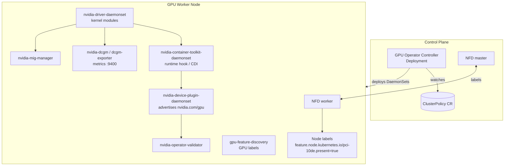

# 3. Architecture and Components




## 3.1 Component reference

| Component | Kind | Purpose |
|---|---|---|
| **gpu-operator** | Deployment | Reconciles `ClusterPolicy` and creates and updates all the DaemonSets |
| **Node Feature Discovery (NFD)** | DaemonSet plus Deployment | Labels nodes with PCI vendor `10de` (NVIDIA), kernel version, and OS. The operator targets nodes labeled `feature.node.kubernetes.io/pci-10de.present=true` |
| **nvidia-driver-daemonset** | DaemonSet | Compiles or loads the NVIDIA kernel modules inside a privileged container and starts `nvidia-persistenced` |
| **nvidia-container-toolkit-daemonset** | DaemonSet | Installs the NVIDIA runtime and configures containerd or CRI-O (`nvidia` runtime class, CDI specs) |
| **nvidia-device-plugin-daemonset** | DaemonSet | Advertises `nvidia.com/gpu` (or MIG resources) to the kubelet and handles time-slicing and MPS config |
| **nvidia-device-plugin-mps-control-daemon** | DaemonSet | Runs the MPS control daemon when MPS sharing is enabled |
| **gpu-feature-discovery (GFD)** | DaemonSet | Adds `nvidia.com/gpu.*` labels: product, memory, count, MIG capability, CUDA version |
| **nvidia-dcgm** | DaemonSet | The Data Center GPU Manager host engine |
| **nvidia-dcgm-exporter** | DaemonSet | Exposes GPU metrics in Prometheus format on port 9400 |
| **nvidia-mig-manager** | DaemonSet | Applies MIG partition profiles from the `nvidia.com/mig.config` node label |
| **nvidia-operator-validator** | DaemonSet | Validates the driver, toolkit, CUDA, and plugin, and gates the other components |
| **nvidia-node-status-exporter** | DaemonSet | Exports operator health metrics |
| **nvidia-peermem / GDRCopy / nvidia-fs** | Driver sidecars | GPUDirect RDMA and GPUDirect Storage support |
| **sandbox-device-plugin, vfio-manager, vgpu-manager** | DaemonSets | GPU passthrough and vGPU for KubeVirt and Kata workloads |

## 3.2 Startup order (dependency chain)

```
NFD labels node
   └─> driver loads kernel modules  (driver-validation)
         └─> toolkit configures runtime (toolkit-validation)
               └─> CUDA sample runs     (cuda-validation)
                     └─> device plugin registers resources (plugin-validation)
                           └─> GFD, DCGM, DCGM-exporter, MIG manager start
```

Each stage waits on files in `/run/nvidia/validations/` that the validator writes. This is why a broken driver blocks everything downstream. It is also the first place to look when you troubleshoot.

## 3.3 Node workload modes

The `nvidia.com/gpu.workload.config` node label selects what gets deployed on a node:

| Value | Use |
|---|---|
| `container` (default) | Normal containers with the device plugin |
| `vm-passthrough` | KubeVirt or Kata with the full GPU passed through via VFIO |
| `vm-vgpu` | KubeVirt with NVIDIA vGPU |
