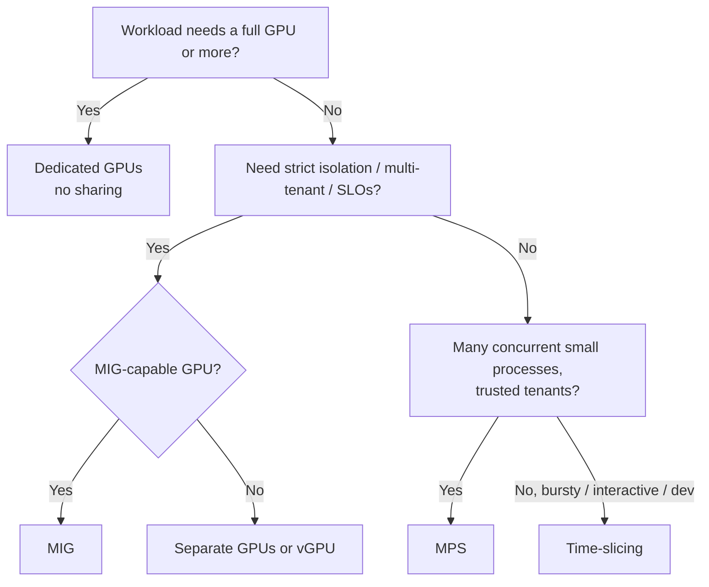

# 9. GPU Sharing: Time-Slicing, MPS, MIG, vGPU


One of the biggest sources of waste is giving a whole 80 GB GPU to a workload that uses 5% of it. Kubernetes offers several sharing strategies.

## 9.1 Comparison

| Feature | Time-Slicing | MPS | MIG | vGPU |
|---|---|---|---|---|
| Isolation (memory) | ❌ None | ⚠️ Limits can be set, no hard fault isolation | ✅ Hardware | ✅ Hypervisor |
| Isolation (fault) | ❌ | ❌ (one client fault can affect others) | ✅ | ✅ |
| Isolation (compute) | Temporal (context switch) | Spatial (concurrent SMs) | Hardware (dedicated SMs) | Temporal/hypervisor |
| Concurrency | Sequential slices | **True concurrency** | True concurrency | Time-sliced |
| Performance overhead | Context-switch overhead | Low | ~None | Low to moderate |
| GPU support | All | Volta+ | A100, A30, H100, H200, B200, GB200, RTX Pro 6000 Blackwell, and others | Licensed vGPU GPUs |
| Reconfiguration | ConfigMap | ConfigMap | Node label (requires GPU idle) | VM profile |
| Best for | Dev/test, notebooks, bursty light inference | Many small inference processes, HPC with many small kernels | Multi-tenant production, guaranteed QoS | VMs, VDI |

## 9.2 Time-slicing

The device plugin advertises `N` replicas of each GPU. Pods share the GPU by time-multiplexing.

```yaml
apiVersion: v1
kind: ConfigMap
metadata:
  name: time-slicing-config
  namespace: gpu-operator
data:
  any: |-
    version: v1
    flags:
      migStrategy: none
    sharing:
      timeSlicing:
        renameByDefault: false      # true => resource becomes nvidia.com/gpu.shared
        failRequestsGreaterThanOne: true
        resources:
          - name: nvidia.com/gpu
            replicas: 4
  # A second profile, selectable per node:
  l4-heavy: |-
    version: v1
    sharing:
      timeSlicing:
        resources:
          - name: nvidia.com/gpu
            replicas: 8
```

```bash
kubectl apply -f time-slicing-config.yaml

# Cluster-wide default profile
kubectl patch clusterpolicies.nvidia.com/cluster-policy --type merge \
  -p '{"spec":{"devicePlugin":{"config":{"name":"time-slicing-config","default":"any"}}}}'

# Override per node
kubectl label node <node> nvidia.com/device-plugin.config=l4-heavy --overwrite
```

Result: a node with 1 GPU now reports `nvidia.com/gpu: 4`, and GFD sets `nvidia.com/gpu.replicas=4` and `nvidia.com/gpu.product=<name>-SHARED`.

**Caveats:**

- There is **no memory isolation**. One pod can allocate all the VRAM and cause OOM errors in the others. Applications must limit their own memory (for example the PyTorch `torch.cuda.set_per_process_memory_fraction`, the vLLM `--gpu-memory-utilization`, or the TF `allow_growth`).
- Requesting `nvidia.com/gpu: 2` gives you 2 *replicas*. They may be on the **same** physical GPU, so this gives no extra compute. Use `failRequestsGreaterThanOne: true` to prevent this.
- Context switching adds overhead. Utilization looks high, but per-job throughput drops.

## 9.3 MPS (Multi-Process Service)

MPS lets kernels from multiple processes run **concurrently** on one GPU, with each process limited to a share of the SMs and memory. The device plugin (v0.15+) runs an MPS control daemon for you.

```yaml
apiVersion: v1
kind: ConfigMap
metadata:
  name: mps-config
  namespace: gpu-operator
data:
  any: |-
    version: v1
    sharing:
      mps:
        renameByDefault: false
        resources:
          - name: nvidia.com/gpu
            replicas: 4          # each client gets ~1/4 of SMs and memory
```

```bash
kubectl patch clusterpolicies.nvidia.com/cluster-policy --type merge \
  -p '{"spec":{"devicePlugin":{"config":{"name":"mps-config","default":"any"}}}}'
```

**When MPS beats time-slicing:** Many small inference processes that each underuse SMs. With MPS they overlap instead of taking turns, which often gives 2 to 4 times the aggregate throughput.

**Caveats:** A fatal error in one client can affect all clients on that GPU. MPS cannot be combined with MIG on the same GPU through the device plugin.

## 9.4 MIG (Multi-Instance GPU)

MIG partitions a GPU **in hardware** into up to 7 instances. Each instance has dedicated SMs, L2 cache slices, memory controllers, and memory, giving strong isolation and predictable performance.

**Example A100 80GB / H100 80GB profiles:**

| Profile | Compute slices | Memory | Max instances |
|---|---|---|---|
| `1g.10gb` | 1/7 | 10 GB | 7 |
| `1g.20gb` | 1/7 | 20 GB | 4 |
| `2g.20gb` | 2/7 | 20 GB | 3 |
| `3g.40gb` | 3/7 | 40 GB | 2 |
| `4g.40gb` | 4/7 | 40 GB | 1 |
| `7g.80gb` | 7/7 | 80 GB | 1 |

(H100 also has `1g.10gb+me` with a media engine. H200, B200, and A100 40GB use different memory sizes. Run `nvidia-smi mig -lgip` on the node to see the exact profiles.)

### Strategies

- **`single`:** All GPUs on a node use the same profile. The resource stays `nvidia.com/gpu`, so existing pod specs work unchanged.
- **`mixed`:** Different profiles on the same node or GPU. Resources are named `nvidia.com/mig-1g.10gb`, `nvidia.com/mig-3g.40gb`, and so on.

```bash
helm upgrade gpu-operator nvidia/gpu-operator -n gpu-operator --reuse-values \
  --set mig.strategy=mixed
```

### Applying a MIG layout

The MIG manager watches the `nvidia.com/mig.config` label:

```bash
# All GPUs -> 7 x 1g.10gb
kubectl label node <node> nvidia.com/mig.config=all-1g.10gb --overwrite

# A balanced built-in mix
kubectl label node <node> nvidia.com/mig.config=all-balanced --overwrite

# Watch progress
kubectl get node <node> -o jsonpath='{.metadata.labels.nvidia\.com/mig\.config\.state}'
# pending -> success
```

> The MIG manager stops GPU clients (device plugin, DCGM, and so on) while it reconfigures. **Drain GPU workloads first.** Some GPUs or clouds also require a GPU reset or node reboot to enable MIG mode.

### Custom MIG profiles

```yaml
apiVersion: v1
kind: ConfigMap
metadata:
  name: custom-mig-config
  namespace: gpu-operator
data:
  config.yaml: |
    version: v1
    mig-configs:
      all-disabled:
        - devices: all
          mig-enabled: false
      # GPUs 0-3 for inference (small slices), 4-7 for training (whole GPU)
      inference-training-split:
        - devices: [0,1,2,3]
          mig-enabled: true
          mig-devices:
            "1g.10gb": 3
            "2g.20gb": 2
        - devices: [4,5,6,7]
          mig-enabled: false
```

```bash
kubectl patch clusterpolicies.nvidia.com/cluster-policy --type merge \
  -p '{"spec":{"migManager":{"config":{"name":"custom-mig-config"}}}}'
kubectl label node <node> nvidia.com/mig.config=inference-training-split --overwrite
```

Requesting a slice (mixed strategy):

```yaml
resources:
  limits:
    nvidia.com/mig-2g.20gb: 1
```

### MIG plus time-slicing

You can time-slice MIG instances. For example, 7 × `1g.10gb` instances × 2 replicas gives 14 schedulable units per GPU, which suits very light notebook workloads.

```yaml
sharing:
  timeSlicing:
    resources:
      - name: nvidia.com/mig-1g.10gb
        replicas: 2
```

## 9.5 vGPU and VM passthrough

For KubeVirt VMs, label the node `nvidia.com/gpu.workload.config=vm-vgpu` or `vm-passthrough`, and enable `sandboxWorkloads.enabled=true`. The operator then deploys the vGPU manager or VFIO manager plus the sandbox device plugin. vGPU requires an NVIDIA AI Enterprise / vGPU license and a license server (DLS/CLS) configured via `driver.licensingConfig`.

## 9.6 Choosing a sharing strategy


