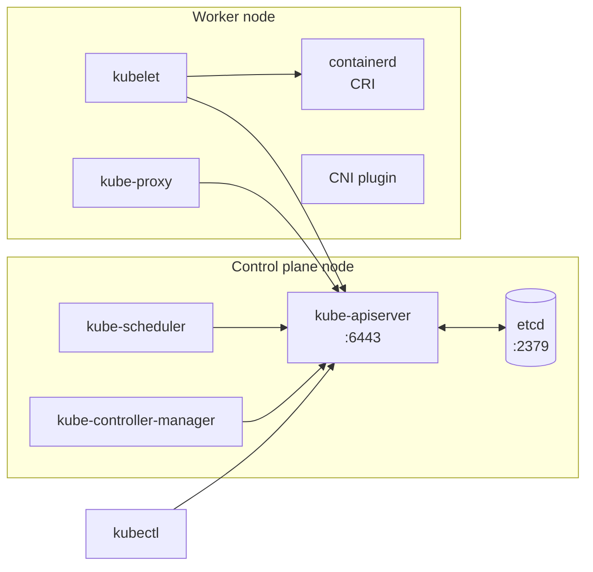

# 1. Fundamentals & kubectl Speed

**Level: Beginner.** The exam is a race against the clock. Fast, accurate `kubectl` is worth more than any single topic.

---

## 1.1 Cluster architecture in 2 minutes



| Component | Runs as (kubeadm) | Job | Where to look when broken |
|---|---|---|---|
| kube-apiserver | Static pod | Front door. Validates and stores objects in etcd | `/etc/kubernetes/manifests/kube-apiserver.yaml`, `crictl ps -a`, `/var/log/pods/` |
| etcd | Static pod | Key-value store for all cluster state | `/etc/kubernetes/manifests/etcd.yaml`, `/var/lib/etcd` |
| kube-scheduler | Static pod | Assigns pods to nodes | Pods stuck `Pending` with no events → scheduler down |
| kube-controller-manager | Static pod | Reconcile loops (Deployments, ReplicaSets, Nodes, ...) | Deployments not creating pods → CM down |
| kubelet | **systemd service** | Runs pods on the node, reports status | `systemctl status kubelet`, `journalctl -u kubelet` |
| kube-proxy | DaemonSet | Service VIP → pod routing (iptables/IPVS/nftables) | `k -n kube-system logs ds/kube-proxy` |
| CoreDNS | Deployment | Cluster DNS | `k -n kube-system get pods -l k8s-app=kube-dns` |
| Container runtime | systemd service | Runs containers via CRI | `systemctl status containerd`, `crictl` |

**Static pods:** The kubelet runs every manifest in `staticPodPath` (default `/etc/kubernetes/manifests`) directly, without the scheduler. Edit the file and the kubelet recreates the pod. That's how you fix control plane components.

---

## 1.2 Contexts and namespaces

```bash
k config get-contexts                     # list clusters/contexts
k config current-context
k config use-context <name>               # EVERY exam task starts with this
k config set-context --current --namespace=dev   # change default namespace
k get pods -A                             # all namespaces
k get pods -n kube-system
```

---

## 1.3 Imperative commands: your biggest time saver

| Goal | Command |
|---|---|
| Pod | `k run nginx --image=nginx --port=80 --labels=app=web` |
| Pod with command | `k run bb --image=busybox --restart=Never -- sleep 3600` |
| Deployment | `k create deploy web --image=nginx --replicas=3` |
| Scale | `k scale deploy web --replicas=5` |
| Service (ClusterIP) | `k expose deploy web --port=80 --target-port=8080` |
| Service (NodePort) | `k expose deploy web --type=NodePort --port=80` (then `k edit` to set `nodePort`) |
| ConfigMap | `k create cm app-cfg --from-literal=MODE=prod --from-file=app.properties` |
| Secret | `k create secret generic db --from-literal=PASSWORD=s3cr3t` |
| TLS secret | `k create secret tls web-tls --cert=tls.crt --key=tls.key` |
| ServiceAccount | `k create sa builder` |
| Role | `k create role pod-reader --verb=get,list,watch --resource=pods` |
| RoleBinding | `k create rolebinding rb --role=pod-reader --serviceaccount=dev:builder` |
| ClusterRole(Binding) | `k create clusterrole ...` / `k create clusterrolebinding ...` |
| Job | `k create job hello --image=busybox -- echo hi` |
| CronJob | `k create cronjob tick --image=busybox --schedule="*/5 * * * *" -- date` |
| Ingress | `k create ingress web --rule="app.example.com/*=web:80"` |
| Quota | `k create quota q --hard=pods=10,requests.cpu=4` |
| PriorityClass | `k create priorityclass high --value=100000 --description="critical"` |
| PDB | `k create pdb web-pdb --selector=app=web --min-available=2` |
| HPA | `k autoscale deploy web --min=2 --max=10 --cpu-percent=70` |
| Label / annotate | `k label node n1 disk=ssd` · `k annotate deploy web owner=team-a` |
| Set image | `k set image deploy/web nginx=nginx:1.27` |
| Set resources | `k set resources deploy web --requests=cpu=100m,memory=128Mi --limits=memory=256Mi` |
| Set env | `k set env deploy/web MODE=prod` |

### Generate YAML, then edit

```bash
export do="--dry-run=client -o yaml"
k run web --image=nginx $do > pod.yaml
k create deploy web --image=nginx $do > deploy.yaml
k create job j --image=busybox $do -- sh -c "echo hi" > job.yaml
vim deploy.yaml && k apply -f deploy.yaml
```

### Change running objects

```bash
k edit deploy web                         # live edit
k get pod web -o yaml > web.yaml          # pod fields are mostly immutable:
k replace --force -f web.yaml             #   edit the file, then delete + recreate in one step
k patch deploy web -p '{"spec":{"replicas":2}}'
```

---

## 1.4 Finding fields fast without docs

```bash
k explain pod.spec.containers.livenessProbe
k explain deploy.spec.strategy --recursive
k api-resources | grep -i netpol          # short names, API groups, namespaced?
k api-resources --namespaced=false        # cluster-scoped kinds
```

---

## 1.5 Output formatting (often asked: "write the result to /opt/xyz.txt")

```bash
# Wide output, labels, selectors
k get pods -o wide --show-labels
k get pods -l app=web,tier!=db

# Sorting
k get pods --sort-by=.metadata.creationTimestamp
k get pv --sort-by=.spec.capacity.storage

# JSONPath
k get nodes -o jsonpath='{.items[*].metadata.name}'
k get nodes -o jsonpath='{range .items[*]}{.metadata.name}{"\t"}{.status.addresses[?(@.type=="InternalIP")].address}{"\n"}{end}'
k get pod web -o jsonpath='{.spec.containers[*].image}'
k get secret db -o jsonpath='{.data.PASSWORD}' | base64 -d

# Custom columns
k get pods -o custom-columns=NAME:.metadata.name,NODE:.spec.nodeName,IMAGE:.spec.containers[0].image

# Write exactly what's asked
k get pods -n prod --no-headers | wc -l
k get nodes -o name > /opt/nodes.txt
```

---

## 1.6 Test connectivity from inside the cluster

```bash
k run tmp --rm -it --image=busybox:1.36 --restart=Never -- sh
#   wget -qO- http://web.default.svc.cluster.local
#   nslookup web.default
k run tmp --rm -it --image=nicolaka/netshoot --restart=Never -- bash   # if images are pullable
k exec -it web -- sh
k port-forward svc/web 8080:80
```

---

## 1.7 Checklist: can you do these in under 30 seconds each?

- [ ] Switch context and set a default namespace
- [ ] Create a pod with labels, a port and a command
- [ ] Generate Deployment YAML to a file
- [ ] Expose a Deployment as a NodePort Service
- [ ] Find which node a pod runs on, and its IP
- [ ] Print all node InternalIPs with JSONPath
- [ ] Decode a Secret value
- [ ] Use `k explain` to find the field name for a readiness probe

Next: **[2. Workloads & Scheduling →](02-workloads-scheduling.md)**
