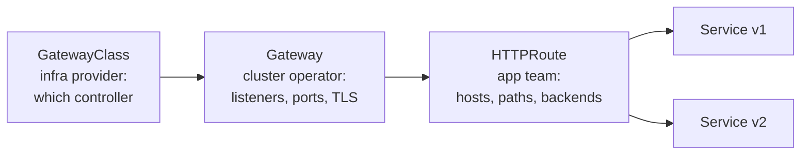

# 3. Services & Networking (20%)

**Level: Intermediate.** NetworkPolicy and Gateway API tasks are high-value and easy to get subtly wrong.

---

## 3.1 The Kubernetes network model

- Every pod gets its **own IP**. Pods can reach all other pods **without NAT**, across nodes. The **CNI plugin** (Calico, Cilium, Flannel, ...) implements this.
- **Services** give a stable virtual IP and DNS name in front of a changing set of pods. **kube-proxy** (or Cilium's eBPF replacement) programs the routing.
- **NetworkPolicies** restrict that default "everything can talk" model. They only work if the CNI enforces them. Flannel alone does **not**; Calico and Cilium do.

Where cluster CIDRs are configured:

```bash
k cluster-info dump | grep -m1 -E 'service-cluster-ip-range|cluster-cidr'
grep -E 'service-cluster-ip-range' /etc/kubernetes/manifests/kube-apiserver.yaml
grep -E 'cluster-cidr' /etc/kubernetes/manifests/kube-controller-manager.yaml
k get nodes -o jsonpath='{.items[*].spec.podCIDR}'
```

---

## 3.2 Services

| Type | Reachable from | Notes |
|---|---|---|
| **ClusterIP** (default) | Inside the cluster | Virtual IP plus DNS name |
| **NodePort** | `<anyNodeIP>:<30000-32767>` | Also gets a ClusterIP |
| **LoadBalancer** | External LB IP | Needs a cloud or MetalLB. Also gets NodePort and ClusterIP |
| **ExternalName** | DNS CNAME | No proxying |
| **Headless** (`clusterIP: None`) | DNS returns the pod IPs directly | StatefulSets |

```bash
k expose deploy web --port=80 --target-port=8080 --name=web-svc
k expose pod db --port=5432 --type=NodePort
k get svc,endpointslices -l app=web        # or: k get endpoints web-svc
```

```yaml
apiVersion: v1
kind: Service
metadata: {name: web-svc}
spec:
  type: NodePort
  selector: {app: web}          # MUST match pod labels
  ports:
  - port: 80                    # Service port
    targetPort: 8080            # container port (number or named port)
    nodePort: 30080             # optional, 30000-32767
    protocol: TCP
```

**No endpoints?** Almost always one of: a selector/label mismatch, pods not Ready (readiness probe failing), or a wrong `targetPort`. Compare `k get pods --show-labels` against `k describe svc`.

---

## 3.3 CoreDNS and service discovery

| Record | Name |
|---|---|
| Service | `<svc>.<ns>.svc.cluster.local` (short: `<svc>` in the same namespace, `<svc>.<ns>` elsewhere) |
| Pod | `<pod-ip-with-dashes>.<ns>.pod.cluster.local` (e.g. `10-244-1-5.default.pod.cluster.local`) |
| Headless/StatefulSet pod | `<pod-name>.<headless-svc>.<ns>.svc.cluster.local` |

```bash
k run dns --rm -it --image=busybox:1.36 --restart=Never -- nslookup web-svc.default
k -n kube-system get deploy coredns
k -n kube-system get cm coredns -o yaml          # the Corefile
cat /var/lib/kubelet/config.yaml | grep -A1 clusterDNS
```

Corefile highlights: `kubernetes cluster.local in-addr.arpa ip6.arpa` (cluster zone), `forward . /etc/resolv.conf` (upstream DNS), `cache 30`. Add a custom stub domain with another server block, e.g. `corp.local:53 { forward . 10.0.0.53 }`. After editing, run `k -n kube-system rollout restart deploy coredns`.

Pod DNS policy: `dnsPolicy: ClusterFirst` (default), `Default` (node's resolv.conf), `None` plus `dnsConfig`.

---

## 3.4 NetworkPolicies

**Rules of the game:**

1. Pods are open until **any** policy selects them. Then only explicitly allowed traffic is permitted, for the listed `policyTypes`.
2. Policies are **additive** (a union). There are no deny rules beyond "not allowed".
3. For egress, **remember DNS** (UDP and TCP port 53), or name resolution breaks.

### Default deny

```yaml
apiVersion: networking.k8s.io/v1
kind: NetworkPolicy
metadata: {name: default-deny-all, namespace: prod}
spec:
  podSelector: {}                 # all pods in namespace
  policyTypes: [Ingress, Egress]  # no rules listed = deny everything
```

### Allow specific traffic

```yaml
apiVersion: networking.k8s.io/v1
kind: NetworkPolicy
metadata: {name: api-allow, namespace: backend}
spec:
  podSelector:
    matchLabels: {app: api}          # policy applies TO these pods
  policyTypes: [Ingress, Egress]
  ingress:
  - from:
    - namespaceSelector:             # ONE item with both selectors = AND:
        matchLabels:                 # pods labeled app=web IN namespace frontend
          kubernetes.io/metadata.name: frontend
      podSelector:
        matchLabels: {app: web}
    ports:
    - {protocol: TCP, port: 8080}
  egress:
  - to:
    - podSelector: {matchLabels: {app: db}}
    ports:
    - {protocol: TCP, port: 5432}
  - ports:                           # DNS to anywhere
    - {protocol: UDP, port: 53}
    - {protocol: TCP, port: 53}
```

### The AND vs OR trap

```yaml
# AND: one list item -> pod must match BOTH
- from:
  - namespaceSelector: {matchLabels: {team: a}}
    podSelector: {matchLabels: {app: web}}

# OR: two list items (note the second dash) -> either matches
- from:
  - namespaceSelector: {matchLabels: {team: a}}
  - podSelector: {matchLabels: {app: web}}
```

- `podSelector` alone in `from` means pods **in the policy's own namespace**.
- Every namespace has the label `kubernetes.io/metadata.name=<ns>`, so use it to select a namespace by name.
- `ipBlock: {cidr: 10.0.0.0/16, except: [10.0.5.0/24]}` handles external IPs.

**Verify:**

```bash
k -n frontend run t --rm -it --image=busybox:1.36 --labels=app=web --restart=Never -- wget -qO- -T2 api.backend:8080
k -n frontend run t --rm -it --image=busybox:1.36 --labels=app=other --restart=Never -- wget -qO- -T2 api.backend:8080   # should time out
```

---

## 3.5 Ingress

```bash
k get ingressclass                                   # which controller/class exists?
k create ingress web --class=nginx \
  --rule="app.example.com/=web-svc:80" \
  --rule="app.example.com/api*=api-svc:8080" \
  --rule="secure.example.com/*=web-svc:80,tls=web-tls"
```

```yaml
apiVersion: networking.k8s.io/v1
kind: Ingress
metadata: {name: web}
spec:
  ingressClassName: nginx
  tls:
  - hosts: [secure.example.com]
    secretName: web-tls
  rules:
  - host: app.example.com
    http:
      paths:
      - path: /api
        pathType: Prefix        # Prefix | Exact | ImplementationSpecific
        backend:
          service:
            name: api-svc
            port: {number: 8080}
```

Test: `curl -H "Host: app.example.com" http://<node-ip>:<ingress-nodeport>/api`.

---

## 3.6 Gateway API (new in the 2025 curriculum)

Gateway API is the successor to Ingress. It splits responsibilities across roles:



```bash
k get gatewayclass                      # the exam cluster will have a controller installed
k get gateway,httproute -A
k explain httproute.spec.rules --api-version=gateway.networking.k8s.io/v1
```

### Gateway

```yaml
apiVersion: gateway.networking.k8s.io/v1
kind: Gateway
metadata: {name: web-gw, namespace: default}
spec:
  gatewayClassName: nginx                # from `k get gatewayclass`
  listeners:
  - name: http
    protocol: HTTP
    port: 80
  - name: https
    protocol: HTTPS
    port: 443
    hostname: secure.example.com
    tls:
      mode: Terminate
      certificateRefs:
      - kind: Secret
        name: web-tls                    # kubernetes.io/tls secret
    allowedRoutes:
      namespaces:
        from: Same                       # Same | All | Selector
```

### HTTPRoute: path routing, header matching, traffic split

```yaml
apiVersion: gateway.networking.k8s.io/v1
kind: HTTPRoute
metadata: {name: web-route, namespace: default}
spec:
  parentRefs:
  - name: web-gw
    sectionName: http                    # optional: attach to one listener
  hostnames: ["app.example.com"]
  rules:
  - matches:
    - path: {type: PathPrefix, value: /api}
    backendRefs:
    - {name: api-svc, port: 8080}
  - matches:
    - headers:
      - {name: x-canary, value: "true"}
    backendRefs:
    - {name: web-v2, port: 80}
  - backendRefs:                         # default: 80/20 split
    - {name: web-v1, port: 80, weight: 80}
    - {name: web-v2, port: 80, weight: 20}
```

### Migrating an Ingress to Gateway API (a likely task shape)

| Ingress | Gateway API |
|---|---|
| `ingressClassName` | `Gateway.spec.gatewayClassName` |
| `spec.tls[].secretName` | Gateway listener `tls.certificateRefs` (HTTPS listener) |
| `rules[].host` | `HTTPRoute.spec.hostnames` |
| `paths[].path` + `pathType: Prefix` | `matches[].path` `type: PathPrefix` |
| `backend.service.name/port` | `backendRefs[].name/port` |

Verify:

```bash
k describe gateway web-gw          # Programmed=True, address assigned
k describe httproute web-route     # Parents: Accepted=True, ResolvedRefs=True
curl -H "Host: app.example.com" http://<gateway-address>/api
```

`ResolvedRefs=False` usually means a wrong Service name or port, or a cross-namespace backend without a `ReferenceGrant`.

---

## 3.7 Checklist

- [ ] Expose a Deployment as ClusterIP and NodePort. Fix a Service with no endpoints
- [ ] Resolve a Service and a pod via DNS from a busybox pod. Find the CoreDNS config
- [ ] Write default-deny plus an allow policy with namespace AND pod selectors. Allow DNS egress
- [ ] Create an Ingress with path routing and TLS
- [ ] Create a Gateway plus HTTPRoute with path match, header match and weighted backends
- [ ] Translate an existing Ingress into Gateway + HTTPRoute
- [ ] Find the pod and service CIDRs of the cluster

Next: **[4. Storage →](04-storage.md)**
