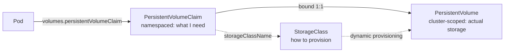

# 4. Storage (10%)

**Level: Intermediate.** These are small, quick tasks. Get them right and bank the points.

---

## 4.1 The model



- **Static provisioning:** An admin creates the PV, and a PVC binds to a matching one (capacity ≥ request, same access mode, same `storageClassName`).
- **Dynamic provisioning:** A PVC names a StorageClass, and the provisioner (CSI driver) creates the PV automatically.

---

## 4.2 StorageClass

```yaml
apiVersion: storage.k8s.io/v1
kind: StorageClass
metadata:
  name: fast
  annotations:
    storageclass.kubernetes.io/is-default-class: "true"   # make it the default
provisioner: rancher.io/local-path          # check what exists: k get sc
reclaimPolicy: Delete                       # Delete (default) | Retain
volumeBindingMode: WaitForFirstConsumer     # bind when a pod uses it (topology-aware)
allowVolumeExpansion: true
parameters: {}                              # provisioner-specific
```

```bash
k get sc                                     # (default) marker shows the default class
k patch sc fast -p '{"metadata":{"annotations":{"storageclass.kubernetes.io/is-default-class":"false"}}}'
```

Only one StorageClass should be the default. When changing it, **remove the annotation from the old one**.

---

## 4.3 PersistentVolume (static)

```yaml
apiVersion: v1
kind: PersistentVolume
metadata: {name: pv-data}
spec:
  capacity: {storage: 1Gi}
  accessModes: [ReadWriteOnce]
  persistentVolumeReclaimPolicy: Retain
  storageClassName: manual            # must match the PVC ("" for no class)
  hostPath:
    path: /mnt/data
    type: DirectoryOrCreate
```

| Access mode | Short | Meaning |
|---|---|---|
| ReadWriteOnce | RWO | Read-write by **one node** (multiple pods on that node can share it) |
| ReadOnlyMany | ROX | Read-only by many nodes |
| ReadWriteMany | RWX | Read-write by many nodes (NFS, CephFS, cloud file stores) |
| ReadWriteOncePod | RWOP | Read-write by **one pod** in the whole cluster |

| Reclaim policy | After the PVC is deleted |
|---|---|
| **Retain** | PV goes to `Released`. Data is kept, and an admin must clean up and reuse it manually (remove `spec.claimRef` to make it `Available` again) |
| **Delete** | PV and the backing storage are deleted (default for dynamic provisioning) |
| Recycle | Deprecated. Don't use |

---

## 4.4 PersistentVolumeClaim and using it in a pod

```yaml
apiVersion: v1
kind: PersistentVolumeClaim
metadata: {name: data, namespace: app}
spec:
  accessModes: [ReadWriteOnce]
  resources:
    requests: {storage: 500Mi}
  storageClassName: manual       # omit to use the default StorageClass
---
apiVersion: v1
kind: Pod
metadata: {name: writer, namespace: app}
spec:
  containers:
  - name: app
    image: busybox:1.36
    command: ["sh", "-c", "echo hello > /data/out.txt; sleep 3600"]
    volumeMounts:
    - {name: data, mountPath: /data}
  volumes:
  - name: data
    persistentVolumeClaim:
      claimName: data
```

```bash
k get pv,pvc -A
k describe pvc data -n app        # Events explain why it's Pending
```

**PVC stuck `Pending`?**

- No PV matches: check capacity, access mode, and `storageClassName`.
- `WaitForFirstConsumer`: this is normal until a pod uses the claim.
- No default StorageClass, and the PVC doesn't name one.
- The provisioner isn't running.

---

## 4.5 Expanding a PVC

```bash
# StorageClass must have allowVolumeExpansion: true
k patch pvc data -n app -p '{"spec":{"resources":{"requests":{"storage":"2Gi"}}}}'
k get pvc data -n app -w
```

You can only increase the size. Some drivers need the pod to restart for the filesystem resize.

---

## 4.6 Other volume types to recognize

| Type | Use |
|---|---|
| `emptyDir` | Scratch space shared by the containers in a pod. Deleted with the pod. `medium: Memory` for tmpfs |
| `hostPath` | Node directory. Used for static pods and node agents. Avoid it for apps |
| `configMap` / `secret` / `projected` | Config and credentials as files |
| `persistentVolumeClaim` | Durable storage |
| CSI (`csi:`) | Provided by a CSI driver (see [Page 5](05-cluster-architecture.md#511-extension-interfaces-cri-cni-csi)) |

StatefulSets create one PVC per replica from `volumeClaimTemplates`, named `<template>-<sts>-<ordinal>`. Those PVCs are **not** deleted when you scale down.

---

## 4.7 Checklist

- [ ] Create a StorageClass and make it the default (and un-default the old one)
- [ ] Create a hostPath PV with Retain, plus a matching PVC, and mount it in a pod
- [ ] Explain RWO vs RWOP vs RWX, and Retain vs Delete
- [ ] Diagnose a Pending PVC from its events
- [ ] Expand a PVC

Next: **[5. Cluster Architecture, Installation & Configuration →](05-cluster-architecture.md)**
