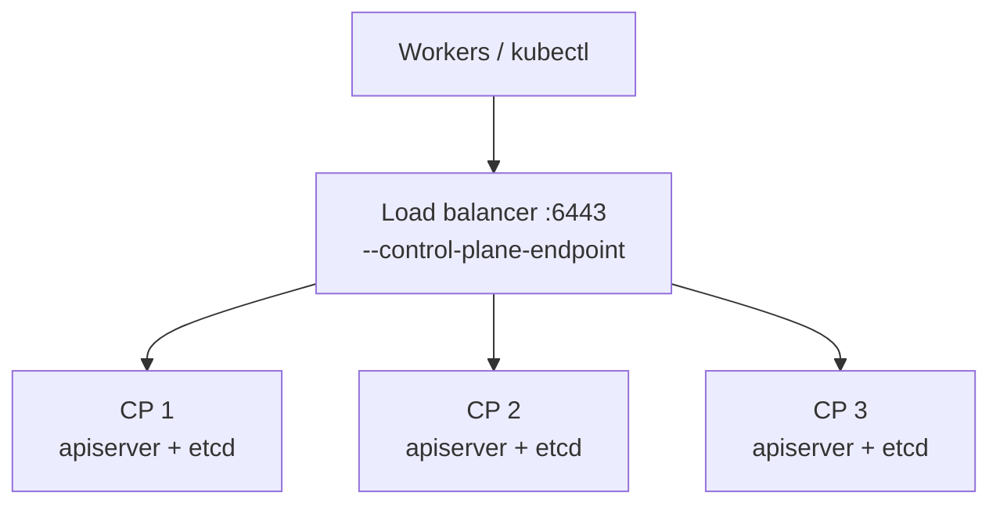
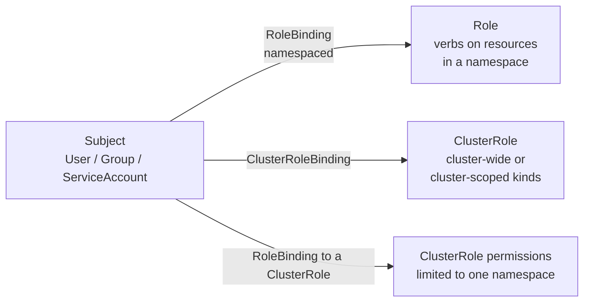

# 5. Cluster Architecture, Installation & Configuration (25%)

**Level: Advanced.** etcd backup and restore, kubeadm upgrades and RBAC are near-certain exam topics. Drill them until you can do them without docs. The commands below follow the official kubeadm docs. `X.Y` stands for the Kubernetes minor version and `X.Y.Z` for the patch version; use whatever the task says.

---

## 5.1 Prepare the node (infrastructure)

```bash
# Kernel modules
cat <<EOF | sudo tee /etc/modules-load.d/k8s.conf
overlay
br_netfilter
EOF
sudo modprobe overlay && sudo modprobe br_netfilter

# Sysctl (persistent; a common task: "set these parameters persistently")
cat <<EOF | sudo tee /etc/sysctl.d/k8s.conf
net.bridge.bridge-nf-call-iptables  = 1
net.bridge.bridge-nf-call-ip6tables = 1
net.ipv4.ip_forward                 = 1
EOF
sudo sysctl --system
sysctl net.ipv4.ip_forward                      # verify

# Swap: off, or configure kubelet swap behavior
sudo swapoff -a && sudo sed -i '/ swap / s/^/#/' /etc/fstab
```

### Container runtime (CRI)

```bash
# containerd: generate config, use the systemd cgroup driver
sudo mkdir -p /etc/containerd
containerd config default | sudo tee /etc/containerd/config.toml
sudo sed -i 's/SystemdCgroup = false/SystemdCgroup = true/' /etc/containerd/config.toml
sudo systemctl restart containerd && sudo systemctl enable containerd

# Task variant: install a provided runtime package (e.g. cri-dockerd)
sudo dpkg -i /path/to/cri-dockerd_*.deb
sudo systemctl enable --now cri-docker.service
systemctl status cri-docker
```

Kubelet and runtime **cgroup drivers must match** (`systemd` on modern systems). kubeadm defaults the kubelet to `systemd`.

---

## 5.2 Install kubeadm, kubelet, kubectl

```bash
sudo apt-get update && sudo apt-get install -y apt-transport-https ca-certificates curl gpg
sudo mkdir -p -m 755 /etc/apt/keyrings
curl -fsSL https://pkgs.k8s.io/core:/stable:/vX.Y/deb/Release.key \
  | sudo gpg --dearmor -o /etc/apt/keyrings/kubernetes-apt-keyring.gpg
echo 'deb [signed-by=/etc/apt/keyrings/kubernetes-apt-keyring.gpg] https://pkgs.k8s.io/core:/stable:/vX.Y/deb/ /' \
  | sudo tee /etc/apt/sources.list.d/kubernetes.list
sudo apt-get update
sudo apt-get install -y kubelet kubeadm kubectl
sudo apt-mark hold kubelet kubeadm kubectl
sudo systemctl enable --now kubelet
```

The `pkgs.k8s.io` repo is **per minor version**. To install or upgrade to another minor version, change `vX.Y` in the `.list` file first.

---

## 5.3 Create the cluster

```bash
# Control plane
sudo kubeadm init \
  --pod-network-cidr=192.168.0.0/16 \
  --apiserver-advertise-address=<cp-ip> \
  --kubernetes-version=vX.Y.Z           # optional

mkdir -p $HOME/.kube
sudo cp -i /etc/kubernetes/admin.conf $HOME/.kube/config
sudo chown $(id -u):$(id -g) $HOME/.kube/config

# Install a CNI (nodes stay NotReady until you do). Use the manifest/URL the task gives.
# Need NetworkPolicy support? Pick Calico or Cilium, not plain Flannel.
kubectl apply -f <cni-manifest.yaml>

# Join command for workers (tokens expire after 24h)
kubeadm token create --print-join-command
```

```bash
# Worker
sudo kubeadm join <cp-ip>:6443 --token <t> --discovery-token-ca-cert-hash sha256:<h>
```

Check the result with `k get nodes`, `k get pods -n kube-system`.

---

## 5.4 Highly available control plane



```bash
sudo kubeadm init --control-plane-endpoint "lb.example.com:6443" --upload-certs \
  --pod-network-cidr=192.168.0.0/16
# Output includes a join command with --control-plane --certificate-key <key>
sudo kubeadm join lb.example.com:6443 --token <t> \
  --discovery-token-ca-cert-hash sha256:<h> --control-plane --certificate-key <key>
```

- **Stacked etcd:** etcd runs on each control plane node (simpler). **External etcd:** a separate etcd cluster (more resilient).
- etcd needs a **quorum**: 3 members tolerate 1 failure, and 5 members tolerate 2. Always use an odd number.
- The uploaded certs (`--upload-certs`) expire after 2 hours. To get a fresh key: `sudo kubeadm init phase upload-certs --upload-certs`.

---

## 5.5 Upgrade the cluster (one minor version at a time)

### Control plane node

```bash
# 1. Point apt at the new minor version, then upgrade kubeadm
sudo sed -i 's|/v[0-9.]*/deb/|/vX.Y/deb/|' /etc/apt/sources.list.d/kubernetes.list
sudo apt-get update
apt-cache madison kubeadm                    # list available X.Y.Z-* versions
sudo apt-mark unhold kubeadm && \
  sudo apt-get install -y kubeadm='X.Y.Z-*' && sudo apt-mark hold kubeadm
kubeadm version

# 2. Plan and apply
sudo kubeadm upgrade plan
sudo kubeadm upgrade apply vX.Y.Z            # first control plane node only
#   other control plane nodes: sudo kubeadm upgrade node

# 3. Drain, upgrade kubelet + kubectl, restart
kubectl drain <cp-node> --ignore-daemonsets
sudo apt-mark unhold kubelet kubectl && \
  sudo apt-get install -y kubelet='X.Y.Z-*' kubectl='X.Y.Z-*' && \
  sudo apt-mark hold kubelet kubectl
sudo systemctl daemon-reload && sudo systemctl restart kubelet
kubectl uncordon <cp-node>
```

### Worker node

```bash
# from the control plane:  kubectl drain <worker> --ignore-daemonsets --delete-emptydir-data
# on the worker:
sudo sed -i 's|/v[0-9.]*/deb/|/vX.Y/deb/|' /etc/apt/sources.list.d/kubernetes.list
sudo apt-get update
sudo apt-mark unhold kubeadm && sudo apt-get install -y kubeadm='X.Y.Z-*' && sudo apt-mark hold kubeadm
sudo kubeadm upgrade node
sudo apt-mark unhold kubelet kubectl && \
  sudo apt-get install -y kubelet='X.Y.Z-*' kubectl='X.Y.Z-*' && sudo apt-mark hold kubelet kubectl
sudo systemctl daemon-reload && sudo systemctl restart kubelet
# from the control plane:  kubectl uncordon <worker>
```

Verify with `k get nodes` (VERSION column shows the kubelet version).

**Exam reading tip:** "Upgrade the control plane only" means don't touch workers. "Upgrade to exactly X.Y.Z" means don't just take the latest patch.

---

## 5.6 etcd backup and restore (practice until automatic)

Find the cert paths in the etcd static pod manifest:

```bash
grep -E 'listen-client-urls|cert-file|key-file|trusted-ca-file|data-dir' /etc/kubernetes/manifests/etcd.yaml
```

### Backup

```bash
ETCDCTL_API=3 etcdctl \
  --endpoints=https://127.0.0.1:2379 \
  --cacert=/etc/kubernetes/pki/etcd/ca.crt \
  --cert=/etc/kubernetes/pki/etcd/server.crt \
  --key=/etc/kubernetes/pki/etcd/server.key \
  snapshot save /opt/etcd-backup.db

etcdutl snapshot status /opt/etcd-backup.db -w table     # verify
```

### Restore

```bash
# 1. Restore into a NEW data directory
sudo etcdutl snapshot restore /opt/etcd-backup.db --data-dir /var/lib/etcd-restore
#    (older etcd: ETCDCTL_API=3 etcdctl snapshot restore ... --data-dir ...)

# 2. Point etcd at it: edit the hostPath of the etcd-data volume
sudo vim /etc/kubernetes/manifests/etcd.yaml
#   volumes:
#   - hostPath:
#       path: /var/lib/etcd-restore     # <- was /var/lib/etcd
#       type: DirectoryOrCreate
#     name: etcd-data
#   (Or keep the path and move the restored dir into /var/lib/etcd instead.)

# 3. Wait for etcd + apiserver to come back (1-2 min)
watch sudo crictl ps                       # etcd, kube-apiserver Running
kubectl get pods -A                        # cluster state = snapshot state
```

If the API server doesn't come back, restart the kubelet (`sudo systemctl restart kubelet`) and check `sudo crictl ps -a | grep etcd`, then `crictl logs <id>`. Common causes are a wrong path or permissions.

`etcdctl snapshot restore` is deprecated, and removed in etcd v3.6. Use `etcdutl`, and fall back to `etcdctl` only if `etcdutl` isn't installed.

---

## 5.7 Certificates

```bash
sudo kubeadm certs check-expiration
sudo kubeadm certs renew all                 # then restart control plane static pods:
#   move manifests out of /etc/kubernetes/manifests and back, or restart kubelet
openssl x509 -in /etc/kubernetes/pki/apiserver.crt -noout -text | grep -A2 -E 'Validity|Subject Alternative'
```

### Create a user with a client certificate (CSR API)

```bash
openssl genrsa -out jane.key 2048
openssl req -new -key jane.key -subj "/CN=jane/O=developers" -out jane.csr

cat <<EOF | kubectl apply -f -
apiVersion: certificates.k8s.io/v1
kind: CertificateSigningRequest
metadata:
  name: jane
spec:
  request: $(base64 -w0 < jane.csr)
  signerName: kubernetes.io/kube-apiserver-client
  expirationSeconds: 86400
  usages: ["client auth"]
EOF

kubectl certificate approve jane
kubectl get csr jane -o jsonpath='{.status.certificate}' | base64 -d > jane.crt
```

CN is the **username** and O is the **group**, as used in RBAC subjects.

---

## 5.8 kubeconfig

```bash
kubectl config set-credentials jane --client-key=jane.key --client-certificate=jane.crt --embed-certs=true
kubectl config set-context jane@kubernetes --cluster=kubernetes --user=jane --namespace=dev
kubectl --context=jane@kubernetes get pods
kubectl config view --minify --raw              # current context only
```

kubeconfig = **clusters** (server + CA) + **users** (credentials) + **contexts** (cluster + user + namespace).

---

## 5.9 RBAC



```bash
# Namespaced
k create sa deployer -n dev
k create role deploy-mgr -n dev --verb=get,list,create,update,delete --resource=deployments,pods
k create rolebinding deploy-mgr -n dev --role=deploy-mgr --serviceaccount=dev:deployer

# Cluster-wide
k create clusterrole node-reader --verb=get,list,watch --resource=nodes
k create clusterrolebinding jane-nodes --clusterrole=node-reader --user=jane
k create clusterrolebinding devs-view --clusterrole=view --group=developers

# Subresources and specific names
k create role log-reader --verb=get --resource=pods,pods/log
k create role one-cm --verb=get,update --resource=configmaps --resource-name=app-cfg

# VERIFY (always)
k auth can-i create deployments -n dev --as=system:serviceaccount:dev:deployer   # yes
k auth can-i delete nodes --as=jane                                               # no
k auth can-i --list -n dev --as=system:serviceaccount:dev:deployer
```

- Deployments live in API group `apps`. `--resource=deployments` handles the group for you, but YAML needs `apiGroups: ["apps"]`.
- Use a pod's ServiceAccount via `spec.serviceAccountName: deployer`. Short-lived tokens: `k create token deployer -n dev`.
- Built-in ClusterRoles: `cluster-admin`, `admin`, `edit`, `view`.

---

## 5.10 Helm and Kustomize

### Helm

```bash
helm repo add podinfo https://stefanprodan.github.io/podinfo
helm repo update
helm search repo podinfo --versions | head
helm show values podinfo/podinfo > values.yaml        # see what can be set

helm install web podinfo/podinfo -n web --create-namespace \
  --version <chart-version> --set replicaCount=2 -f values.yaml
helm list -A
helm status web -n web
helm get values web -n web
helm upgrade web podinfo/podinfo -n web --set replicaCount=3 --reuse-values
helm history web -n web
helm rollback web 1 -n web
helm uninstall web -n web

helm template web podinfo/podinfo --set replicaCount=2 > rendered.yaml  # render only
helm pull podinfo/podinfo --untar                                        # inspect locally
helm install web oci://ghcr.io/stefanprodan/charts/podinfo -n web       # OCI registries work too
```

Task variants include "install chart X version Y into namespace Z with value V", "generate manifests to a file", and "find which release deployed resource R" (`helm list -A`, then the labels `app.kubernetes.io/managed-by=Helm`).

### Kustomize (built into kubectl)

```
app/
├── base/
│   ├── deployment.yaml
│   ├── service.yaml
│   └── kustomization.yaml
└── overlays/prod/
    └── kustomization.yaml
```

```yaml
# base/kustomization.yaml
resources:
- deployment.yaml
- service.yaml
---
# overlays/prod/kustomization.yaml
resources:
- ../../base
namespace: prod
namePrefix: prod-
labels:
- pairs: {env: prod}
  includeSelectors: false
images:
- name: nginx
  newTag: "1.27"
replicas:
- name: web
  count: 5
configMapGenerator:
- name: app-cfg
  literals: [MODE=prod]
patches:
- target: {kind: Deployment, name: web}
  patch: |-
    - op: add
      path: /spec/template/spec/containers/0/resources
      value: {limits: {memory: 256Mi}}
```

```bash
kubectl kustomize overlays/prod          # preview
kubectl apply -k overlays/prod           # apply
kubectl delete -k overlays/prod
```

---

## 5.11 Extension interfaces: CRI, CNI, CSI

| Interface | Plugs in | Examples | Where you see it |
|---|---|---|---|
| **CRI** (Container Runtime Interface) | Container runtimes | containerd, CRI-O, cri-dockerd | kubelet `--container-runtime-endpoint` (e.g. `unix:///run/containerd/containerd.sock`), `crictl` |
| **CNI** (Container Network Interface) | Pod networking | Calico, Cilium, Flannel | `/etc/cni/net.d/` (config), `/opt/cni/bin/` (binaries) |
| **CSI** (Container Storage Interface) | Storage | AWS EBS, Ceph, local-path | `k get csidrivers`, StorageClass `provisioner` |

```bash
sudo crictl ps -a                        # containers on this node (works when kubectl doesn't)
sudo crictl pods
sudo crictl logs <container-id>
sudo crictl images
cat /var/lib/kubelet/kubeadm-flags.env   # runtime endpoint and other kubelet flags
ls /etc/cni/net.d/
```

**Nodes `NotReady` right after install?** The CNI isn't installed or its config is missing from `/etc/cni/net.d/`.

---

## 5.12 CRDs and operators

```bash
k get crd
k get crd certificates.cert-manager.io -o yaml | less
k explain certificate.spec                 # CRDs with schemas support explain
k api-resources --api-group=cert-manager.io
k get <crd-plural> -A                       # list custom resources
```

An **operator** is a CRD plus a controller that reconciles custom resources, for example cert-manager, Prometheus Operator or Argo CD. Typical tasks:

- Install an operator from a manifest or Helm chart, then create a custom resource for it.
- List all CRDs from a group, or write a CR's field documentation to a file (`k explain <kind>.spec > /opt/out.txt`).

Minimal CRD to recognize the shape:

```yaml
apiVersion: apiextensions.k8s.io/v1
kind: CustomResourceDefinition
metadata:
  name: backups.example.com            # <plural>.<group>
spec:
  group: example.com
  scope: Namespaced
  names: {plural: backups, singular: backup, kind: Backup, shortNames: [bk]}
  versions:
  - name: v1
    served: true
    storage: true
    schema:
      openAPIV3Schema:
        type: object
        properties:
          spec:
            type: object
            properties:
              schedule: {type: string}
```

---

## 5.13 Checklist

- [ ] Set persistent sysctl parameters. Install a runtime `.deb` and enable its service
- [ ] Run `kubeadm init`, install a CNI, print a join command, join a worker
- [ ] Upgrade a control plane node and a worker node to an exact version
- [ ] Back up etcd to a given path. Restore to a new data dir and fix the manifest
- [ ] Check cert expiration. Create a user via the CSR API with a kubeconfig context
- [ ] Create SA + Role + RoleBinding and ClusterRole + ClusterRoleBinding. Verify with `auth can-i`
- [ ] Helm: install with a version and values, upgrade, roll back, template
- [ ] Kustomize: overlay with namespace, image tag, replicas, patch. `apply -k`
- [ ] Explain CRI/CNI/CSI and find their config on a node
- [ ] List CRDs, explain a custom resource, create one

Next: **[6. Troubleshooting →](06-troubleshooting.md)**
