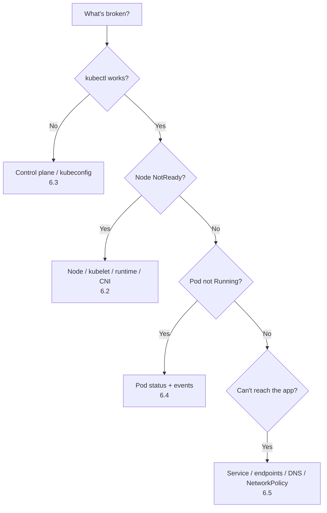

# 6. Troubleshooting (30%)

**Level: Advanced.** This is the biggest domain. The skill being tested is a **systematic method**: find which layer is broken, read the error, fix the smallest thing, then verify.

---

## 6.1 The method



Your four most useful commands:

```bash
k get <thing> -o wide
k describe <thing>                                  # read Events at the bottom
k get events -A --sort-by=.lastTimestamp | tail -20
k logs <pod> [-c container] [--previous]
```

---

## 6.2 Node problems (`NotReady`)

```bash
k get nodes
k describe node worker1          # Conditions + Events: KubeletNotReady, NetworkUnavailable, pressure
ssh worker1
sudo -i
systemctl status kubelet
journalctl -u kubelet --no-pager | tail -50       # the actual error is usually here
systemctl status containerd
```

| Symptom in kubelet logs | Fix |
|---|---|
| `kubelet.service: inactive (dead)` / disabled | `systemctl enable --now kubelet` |
| `failed to load kubelet config file` / wrong path | Fix `/var/lib/kubelet/config.yaml`, or the path in the systemd drop-in |
| Unknown flag / bad arg | Check `/var/lib/kubelet/kubeadm-flags.env` and the drop-in `/usr/lib/systemd/system/kubelet.service.d/10-kubeadm.conf` (sometimes `/etc/systemd/system/kubelet.service.d/`) |
| `unable to load client CA file` / x509 errors | Wrong cert path in the config, or an expired cert |
| `connection refused` to the runtime socket | `systemctl restart containerd`. Check `containerRuntimeEndpoint` |
| `network plugin is not ready: cni config uninitialized` | CNI missing. Check `/etc/cni/net.d/` and the CNI DaemonSet pods |
| Wrong API server address | `/etc/kubernetes/kubelet.conf` `server:` field |

After any kubelet config change:

```bash
systemctl daemon-reload && systemctl restart kubelet && systemctl status kubelet
```

Also check disk space (`df -h`, which affects `DiskPressure`), memory (`free -m`), and the binary path in the unit: `which kubelet` vs `ExecStart`.

---

## 6.3 Control plane problems

**Symptom:** `kubectl` hangs or says `connection refused ... 6443`, or pods stay Pending, or Deployments don't create pods.

```bash
# On the control plane node
sudo crictl ps -a | grep -E 'kube-|etcd'     # which component is Exited/restarting?
sudo crictl logs <container-id>
ls /var/log/pods/ ; sudo tail -50 /var/log/pods/kube-system_kube-apiserver-*/kube-apiserver/*.log
journalctl -u kubelet | grep -i apiserver | tail
```

| Component down | Symptom | Where to fix |
|---|---|---|
| kube-apiserver | `kubectl` fails entirely | `/etc/kubernetes/manifests/kube-apiserver.yaml`: typos in flags, wrong cert paths, wrong `--etcd-servers`, bad image tag |
| etcd | apiserver crash-loops with etcd connection errors | `etcd.yaml`: data dir, cert paths, ports |
| kube-scheduler | New pods `Pending`, **no events** | `kube-scheduler.yaml`: command, `--kubeconfig` path |
| kube-controller-manager | Deployments/ReplicaSets don't create pods. Nodes don't become NotReady | `kube-controller-manager.yaml`: kubeconfig path, cluster-signing cert paths |

Fix workflow for static pods:

```bash
sudo cp /etc/kubernetes/manifests/kube-apiserver.yaml /root/kube-apiserver.yaml.bak   # back up OUTSIDE manifests/
sudo vim /etc/kubernetes/manifests/kube-apiserver.yaml
# kubelet notices the change and recreates the pod (can take ~1 min)
watch sudo crictl ps
```

Never leave backup copies **inside** `/etc/kubernetes/manifests/`. The kubelet would try to run them too.

If the YAML itself is invalid, no container is created at all. Check `journalctl -u kubelet | tail` for parse errors.

### kubeconfig problems

```bash
k config view                     # wrong server/port? wrong cert?
cat ~/.kube/config | grep server
export KUBECONFIG=/etc/kubernetes/admin.conf   # on the control plane, as root
```

---

## 6.4 Pod problems

| Status | Meaning | Look at | Typical fix |
|---|---|---|---|
| `Pending` | Not scheduled | `describe pod` events: Insufficient cpu/memory, taints, node affinity, unbound PVC | Fix requests, tolerations, selectors, PVC. If there are no events at all, the scheduler is down |
| `ContainerCreating` (stuck) | Volume, network or secret issue | Events: missing ConfigMap/Secret, PVC mount, CNI errors | Create the missing object, or fix the volume |
| `ImagePullBackOff` / `ErrImagePull` | Bad image name or tag, or private registry | Events | Fix the image. Add `imagePullSecrets` |
| `CrashLoopBackOff` | Container starts, then exits | `k logs <pod> --previous` | Fix the command/args, env, config, or a failing liveness probe |
| `OOMKilled` (last state) | Exceeded memory limit | `describe pod` → Last State | Raise the limit or fix the app |
| `CreateContainerConfigError` | Missing ConfigMap/Secret key | Events | Create or fix the referenced key |
| `Running` but not `Ready` | Readiness probe failing | Events, probe config | Fix the probe path or port |
| `Evicted` | Node pressure | `describe node` | Free resources. Set requests |
| `Terminating` (stuck) | Finalizers, node gone | `k get pod -o yaml` finalizers | `k delete pod x --force --grace-period=0` |

```bash
k describe pod web | sed -n '/Events/,$p'
k logs web --previous -c app
k get pod web -o yaml | grep -A5 lastState
k debug -it web --image=busybox:1.36 --target=app       # ephemeral debug container
k debug web -it --copy-to=web-debug --container=app -- sh   # copy with shell override
k debug node/worker1 -it --image=busybox:1.36            # node shell (host fs at /host)
```

---

## 6.5 Service, networking and DNS problems

Work through these layers in order:

```bash
# 1. Do pods work directly?
k get pods -l app=web -o wide
k run t --rm -it --image=busybox:1.36 --restart=Never -- wget -qO- -T2 <pod-ip>:8080

# 2. Does the Service have endpoints?
k get endpointslices -l kubernetes.io/service-name=web-svc
k describe svc web-svc              # Selector, TargetPort, Endpoints
k get pods --show-labels            # selector matches?

# 3. Does the Service IP work?
k run t --rm -it --image=busybox:1.36 --restart=Never -- wget -qO- -T2 web-svc:80

# 4. Does DNS work?
k run t --rm -it --image=busybox:1.36 --restart=Never -- nslookup web-svc
k -n kube-system get pods -l k8s-app=kube-dns
k -n kube-system logs -l k8s-app=kube-dns

# 5. Is kube-proxy healthy?
k -n kube-system get ds kube-proxy
k -n kube-system logs ds/kube-proxy | tail

# 6. Is a NetworkPolicy blocking it?
k get netpol -A
```

| Finding | Fix |
|---|---|
| Endpoints empty | Selector/label mismatch, or pods not Ready |
| Endpoints exist but connection refused | `targetPort` ≠ container port, or the app listens on 127.0.0.1 |
| Service IP fails, pod IP works | kube-proxy down or misconfigured |
| Name doesn't resolve | CoreDNS down or crash-looping (check its ConfigMap for typos), or a wrong `clusterDNS` in the kubelet config |
| Works from some namespaces only | NetworkPolicy. Check `podSelector`/`namespaceSelector` and DNS egress |
| NodePort unreachable from outside | Wrong `nodePort`, or a firewall. Test from the node: `curl localhost:<nodePort>` |

---

## 6.6 Monitoring resource usage

```bash
k top nodes
k top pods -A --sort-by=cpu
k top pods -n prod --sort-by=memory --containers
k top pod -l app=web
# "Write the name of the pod using the most CPU in namespace X to /opt/out.txt"
k top pods -n X --sort-by=cpu --no-headers | head -1 | awk '{print $1}' > /opt/out.txt
```

`k top` needs **metrics-server**. If it reports `Metrics API not available`, check `k -n kube-system get deploy metrics-server` and its logs. Lab clusters often need `--kubelet-insecure-tls` in its args.

---

## 6.7 Container output streams (logs)

```bash
k logs web                         # stdout/stderr of the only container
k logs web -c sidecar              # specific container
k logs web --all-containers
k logs web --previous              # crashed instance
k logs web -f --since=10m --tail=100
k logs -l app=web --prefix         # all pods with label
k logs deploy/web                  # one pod of the Deployment
k logs job/backup
k logs web | grep -i error > /opt/errors.txt

# Node-level (when kubectl can't help)
sudo crictl logs <container-id>
ls /var/log/containers/ /var/log/pods/
journalctl -u kubelet -u containerd --since "10 min ago"
```

Apps that write to a file instead of stdout need a **sidecar** that tails the file to stdout (see [Page 2](02-workloads-scheduling.md#24-self-healing-primitives)). Then run `k logs <pod> -c <sidecar>`.

---

## 6.8 Practice: break it yourself

On a practice cluster, break each of these, then fix it without looking:

1. `systemctl stop kubelet` on a worker
2. Change the kubelet's `clientCAFile` path to a wrong file
3. Typo a flag in `kube-apiserver.yaml` (e.g. `--etcd-servers=https://127.0.0.1:2380`)
4. Change the scheduler's `--kubeconfig` to a non-existent file
5. Scale CoreDNS to 0
6. Change a Service selector so it matches nothing
7. Set a wrong `targetPort`
8. Apply a default-deny NetworkPolicy without DNS egress
9. Give a pod a 10Mi memory limit and watch it get OOMKilled
10. Delete `/etc/cni/net.d/*` on a worker

---

## 6.9 Checklist

- [ ] Fix a NotReady node from `journalctl -u kubelet` output
- [ ] Recover a broken kube-apiserver / scheduler / controller-manager static pod
- [ ] Use `crictl` when `kubectl` is down
- [ ] Diagnose Pending, CrashLoopBackOff, ImagePullBackOff, OOMKilled
- [ ] Trace a broken Service: endpoints → targetPort → DNS → kube-proxy → NetworkPolicy
- [ ] Find the top CPU/memory pod and write it to a file
- [ ] Read previous, multi-container and label-selected logs

Next: **[7. Practice Tasks →](07-practice-tasks.md)**
