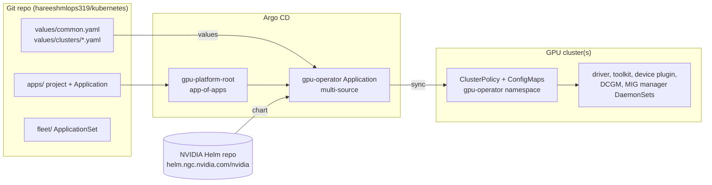
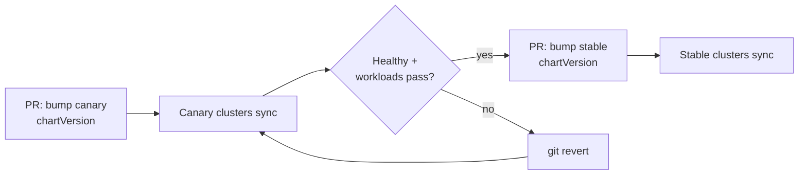

# GitOps Deployment with Argo CD

**Automate the NVIDIA GPU Operator rollout, configuration, and upgrades with Argo CD**

This page turns the manual `helm install` / `kubectl patch` / `kubectl label` steps from the guide into a GitOps workflow. Git holds the desired state of the GPU stack, and Argo CD continuously applies it to one cluster or a whole fleet. To change anything (sharing profiles, MIG layouts, driver versions, operator upgrades), you open a pull request.

All files described here live in the [`gpu-operator-argocd/`](https://github.com/hareeshmlops319/kubernetes/tree/main/gpu-operator-argocd) folder of the repository.

> **Tested against:** GPU Operator chart **v26.7.1** (latest at the time of writing). Every Helm value used here was checked against that chart's `values.yaml` and rendered with `helm template`. Argo CD **v2.6+** is required for multi-source Applications; v3.x is recommended.

---

## 1. Why GitOps for the GPU Operator

| Without GitOps | With Argo CD |
|---|---|
| `helm upgrade` from someone's laptop | Every change is a reviewed pull request |
| `kubectl patch clusterpolicy` drifts from the Helm values | Drift is detected and **self-healed** back to Git |
| Each cluster configured by hand | One ApplicationSet configures the whole fleet |
| Rollback = remembering old values | Rollback = `git revert` |
| No record of who changed the driver version | Git history is the audit log |
| Driver upgrades hit every cluster at once | Canary clusters first, then promote to stable |

---

## 2. Architecture



- **App-of-apps:** You apply one root Application by hand. It creates the `gpu-platform` AppProject (sync wave -1) and the `gpu-operator` Application (wave 0).
- **Multi-source Application:** The chart comes from NVIDIA's Helm repository, and the values come from Git (the `$values` reference). You never copy or fork the chart.
- **All GPU configuration as Helm values:** The chart renders the time-slicing/MPS ConfigMap, the MIG layout ConfigMap, and the DCGM metrics ConfigMap from values (`config.create: true`). There are no hand-applied ConfigMaps and no `kubectl patch`.

---

## 3. Repository layout

```
gpu-operator-argocd/
├── bootstrap/
│   └── root-app.yaml              # apply once; manages everything in apps/
├── apps/
│   ├── project.yaml               # AppProject "gpu-platform" (wave -1)
│   └── gpu-operator.yaml          # GPU Operator Application (wave 0)
├── fleet/
│   └── gpu-operator-appset.yaml   # multi-cluster alternative (canary/stable channels)
├── values/
│   ├── common.yaml                # base values for every cluster
│   └── clusters/
│       ├── in-cluster.yaml        # overrides for the local cluster
│       └── gpu-prod.yaml          # overrides for a cluster named "gpu-prod"
├── argocd-config/
│   └── argocd-cm-health-patch.yaml  # custom health checks for ClusterPolicy etc.
└── hack/
    └── crd2schema.py              # CRDs -> strict JSON schemas for CI validation
```

The CI check lives in `.github/workflows/gpu-operator-argocd-validate.yaml` at the repository root.

---

## 4. Prerequisites

- A Kubernetes cluster with at least one NVIDIA GPU node (see the guide's [Prerequisites](04-prerequisites-and-planning.md)).
- `kubectl` access with cluster-admin rights for the initial bootstrap.
- Argo CD v2.6 or newer (installed in step 1 below if you don't have it).
- Optional: the Prometheus Operator (kube-prometheus-stack), because `dcgmExporter.serviceMonitor.enabled: true` creates a ServiceMonitor. Set it to `false` if you don't run Prometheus.
- **Merge or point at the right branch.** The manifests track `targetRevision: main`. Until these files are merged to `main`, change `targetRevision` in `bootstrap/root-app.yaml`, `apps/gpu-operator.yaml` and `fleet/gpu-operator-appset.yaml` to the branch that contains them.

---

## 5. Step-by-step: single cluster

### Step 1: Install Argo CD (skip if already installed)

```bash
kubectl create namespace argocd
kubectl apply -n argocd --server-side --force-conflicts \
  -f https://raw.githubusercontent.com/argoproj/argo-cd/stable/manifests/install.yaml

kubectl -n argocd rollout status deploy/argocd-server
# Initial admin password
kubectl -n argocd get secret argocd-initial-admin-secret \
  -o jsonpath='{.data.password}' | base64 -d; echo
```

To reach the UI: `kubectl -n argocd port-forward svc/argocd-server 8080:443`, then open https://localhost:8080.

### Step 2: Teach Argo CD what "healthy" means for the GPU stack

Out of the box, Argo CD marks a `ClusterPolicy` healthy as soon as it's applied, even if the driver is still compiling or failing. Add custom health checks:

```bash
kubectl -n argocd patch configmap argocd-cm --type merge \
  --patch-file gpu-operator-argocd/argocd-config/argocd-cm-health-patch.yaml
```

```yaml
# argocd-config/argocd-cm-health-patch.yaml (excerpt)
data:
  # ClusterPolicy.status.state is one of: ready | notReady | ignored
  resource.customizations.health.nvidia.com_ClusterPolicy: |
    hs = {}
    if obj.status ~= nil and obj.status.state ~= nil then
      if obj.status.state == "ready" then
        hs.status = "Healthy"
        hs.message = "All GPU Operator components are ready"
        return hs
      end
      if obj.status.state == "ignored" then
        hs.status = "Degraded"
        hs.message = "ClusterPolicy ignored: only one ClusterPolicy is allowed per cluster"
        return hs
      end
    end
    hs.status = "Progressing"
    hs.message = "Waiting for GPU Operator components (driver, toolkit, device plugin) to become ready"
    return hs
```

The same file also adds:

- a check for `NVIDIADriver` (`ready`/`disabled` are healthy, and `ignored` is degraded),
- the standard `argoproj.io_Application` health check, so the app-of-apps sync waves actually **wait** for the child Application to become healthy. Argo CD stopped assessing Application health by default in v1.8.

The state values (`ready`, `notReady`, `ignored`, `disabled`) come straight from the CRD schemas shipped in chart v26.7.1.

### Step 3: Bootstrap the root Application

```bash
kubectl apply -n argocd -f gpu-operator-argocd/bootstrap/root-app.yaml
```

```yaml
# bootstrap/root-app.yaml
apiVersion: argoproj.io/v1alpha1
kind: Application
metadata:
  name: gpu-platform-root
  namespace: argocd
spec:
  project: default
  source:
    repoURL: https://github.com/hareeshmlops319/kubernetes.git
    targetRevision: main
    path: gpu-operator-argocd/apps
  destination:
    server: https://kubernetes.default.svc
    namespace: argocd
  syncPolicy:
    automated:
      prune: true
      selfHeal: true
```

This is the **only** manual `kubectl apply`. From now on, everything is driven from Git.

### Step 4: Watch it converge

```bash
kubectl -n argocd get applications
# NAME                SYNC STATUS   HEALTH STATUS
# gpu-platform-root   Synced        Progressing
# gpu-operator        Synced        Progressing   <- driver compiling (5-10 min per node)
# ...
# gpu-operator        Synced        Healthy       <- ClusterPolicy state=ready

kubectl get clusterpolicy cluster-policy -o jsonpath='{.status.state}'; echo
kubectl get pods -n gpu-operator
kubectl get nodes -L nvidia.com/gpu.product,nvidia.com/gpu.count
```

With the `argocd` CLI:

```bash
argocd app get gpu-operator
argocd app wait gpu-operator --health --timeout 1800
```

Then run the CUDA test pod from the guide's [Verifying the Installation](07-verifying-the-installation.md) section.

---

## 6. The manifests explained

### 6.1 AppProject: guard rails

```yaml
# apps/project.yaml
apiVersion: argoproj.io/v1alpha1
kind: AppProject
metadata:
  name: gpu-platform
  namespace: argocd
  annotations:
    argocd.argoproj.io/sync-wave: "-1"   # project must exist before its Applications
spec:
  description: NVIDIA GPU Operator and related GPU platform components
  sourceRepos:
    - https://helm.ngc.nvidia.com/nvidia
    - https://github.com/hareeshmlops319/kubernetes.git
  destinations:
    - server: "*"
      namespace: gpu-operator
  clusterResourceWhitelist:
    - { group: "",                        kind: Namespace }
    - { group: apiextensions.k8s.io,      kind: CustomResourceDefinition }
    - { group: rbac.authorization.k8s.io, kind: ClusterRole }
    - { group: rbac.authorization.k8s.io, kind: ClusterRoleBinding }
    - { group: nvidia.com,                kind: ClusterPolicy }
    - { group: nvidia.com,                kind: NVIDIADriver }
    - { group: nvidia.com,                kind: GPUCluster }
    - { group: nfd.k8s-sigs.io,           kind: NodeFeatureRule }
```

The project allows only two sources, one namespace, and an explicit list of cluster-scoped kinds. A typo or a malicious values change can't make this Application deploy something unrelated. The whitelist was derived by rendering chart v26.7.1. With the default values it renders CRDs, ClusterRoles/Bindings and the ClusterPolicy. The other kinds appear only when optional features are enabled.

### 6.2 The GPU Operator Application

```yaml
# apps/gpu-operator.yaml
apiVersion: argoproj.io/v1alpha1
kind: Application
metadata:
  name: gpu-operator
  namespace: argocd
  annotations:
    argocd.argoproj.io/sync-wave: "0"
spec:
  project: gpu-platform
  sources:
    - repoURL: https://helm.ngc.nvidia.com/nvidia
      chart: gpu-operator
      targetRevision: v26.7.1
      helm:
        releaseName: gpu-operator
        valueFiles:
          - $values/gpu-operator-argocd/values/common.yaml
          - $values/gpu-operator-argocd/values/clusters/in-cluster.yaml
        ignoreMissingValueFiles: true
    - repoURL: https://github.com/hareeshmlops319/kubernetes.git
      targetRevision: main
      ref: values
  destination:
    server: https://kubernetes.default.svc
    namespace: gpu-operator
  syncPolicy:
    automated:
      prune: true
      selfHeal: true
    managedNamespaceMetadata:
      labels:
        pod-security.kubernetes.io/enforce: privileged
        pod-security.kubernetes.io/audit: privileged
        pod-security.kubernetes.io/warn: privileged
    syncOptions:
      - CreateNamespace=true
      - ServerSideApply=true
    retry:
      limit: 5
      backoff: { duration: 30s, factor: 2, maxDuration: 5m }
```

**Design decisions:**

| Setting | Why |
|---|---|
| **Multi-source** (`ref: values`) | Use NVIDIA's chart unmodified, and keep only your values in Git. Upgrading the chart is a one-line `targetRevision` change |
| **`releaseName: gpu-operator`** | Keeps resource names identical to a plain `helm install gpu-operator`, so you can migrate an existing Helm install without renaming anything |
| **`CreateNamespace` + `managedNamespaceMetadata`** | Argo CD creates `gpu-operator` with the **privileged** Pod Security labels the driver and toolkit pods need. Without them, admission rejects the DaemonSets |
| **`ServerSideApply=true`** | The ClusterPolicy CRD is about 150 KB. Server-side apply avoids the `last-applied-configuration` annotation size limit and gives cleaner field ownership |
| **`operator.upgradeCRD: false`** (in values) | `helm upgrade` never updates CRDs, so the chart ships a pre-upgrade Job to do it. Argo CD applies the chart's `crds/` directory on **every** sync, which makes that Job redundant |
| **`automated` + `selfHeal`** | Manual `kubectl patch`/`edit` on the ClusterPolicy is reverted within minutes. Git is the only way to change it |
| **No `resources-finalizer`** | Deleting the Argo CD Application does **not** delete the GPU stack, so an accidental `argocd app delete` won't pull drivers out from under running jobs. Remove the GPU stack deliberately (see [Teardown](#12-teardown)) |
| **`retry` with backoff** | The first sync can race CRD registration. Retries make bootstrap hands-off |

> **Helm hooks in this chart.** v26.7.1 renders two delete-time hook Jobs: `gpu-operator-cleanup-gpucluster` (`pre-delete`) and `gpu-operator-node-feature-discovery-prune` (`post-delete`). Argo CD never runs them during a normal sync. Whether they run when an Application is deleted depends on your Argo CD version's support for delete hooks. Because the Application has no finalizer, they don't run on deletion here anyway. Run cleanup manually during teardown.

### 6.3 Values: the whole GPU configuration in Git

`values/common.yaml` is the single source of truth. Its key parts:

```yaml
operator:
  upgradeCRD: false          # Argo CD manages CRDs (see above)
  cleanupCRD: false

cdi:
  enabled: true

driver:
  enabled: true
  kernelModuleType: auto     # auto | open | proprietary
  # version: "<driver-version>"   # pin a production-branch driver
  upgradePolicy:
    autoUpgrade: true
    maxParallelUpgrades: 1
    maxUnavailable: 25%
    gpuPodDeletion: { force: false, timeoutSeconds: 300, deleteEmptyDir: true }
    drain:          { enable: true, force: false, timeoutSeconds: 300, deleteEmptyDir: true }

# GPU sharing profiles -> ConfigMap "device-plugin-config" (rendered by the chart)
devicePlugin:
  config:
    create: true
    name: device-plugin-config
    default: no-sharing                  # cluster-wide default profile
    data:
      no-sharing: |-
        version: v1
        flags:
          migStrategy: single
      time-sliced-4: |-
        version: v1
        flags:
          migStrategy: single
        sharing:
          timeSlicing:
            renameByDefault: false
            failRequestsGreaterThanOne: true
            resources:
              - name: nvidia.com/gpu
                replicas: 4
      mps-4: |-
        version: v1
        flags:
          migStrategy: single
        sharing:
          mps:
            resources:
              - name: nvidia.com/gpu
                replicas: 4

# MIG layouts -> ConfigMap "custom-mig-config"
migManager:
  config:
    create: true
    name: custom-mig-config
    default: all-disabled
    data:
      config.yaml: |-
        version: v1
        mig-configs:
          all-disabled:
            - devices: all
              mig-enabled: false
          all-1g.10gb:
            - devices: all
              mig-enabled: true
              mig-devices: { "1g.10gb": 7 }
          # ... all-3g.40gb, inference-training-split

# Profiling metrics -> ConfigMap "dcgm-metrics"
dcgmExporter:
  config:
    create: true
    name: dcgm-metrics
    data: |-
      DCGM_FI_DEV_GPU_UTIL,            gauge, GPU utilization (%)
      DCGM_FI_PROF_SM_ACTIVE,          gauge, SM active ratio
      DCGM_FI_PROF_PIPE_TENSOR_ACTIVE, gauge, Tensor pipe active ratio
      # ... full list in the file
  serviceMonitor:
    enabled: true
```

Rendering this with `helm template` produces the three ConfigMaps (`device-plugin-config`, `custom-mig-config`, `dcgm-metrics`) and a ClusterPolicy that references each of them by name. This was verified against chart v26.7.1.

Per-cluster differences go in `values/clusters/<cluster-name>.yaml` and are merged on top:

```yaml
# values/clusters/gpu-prod.yaml
driver:
  kernelModuleType: open
  upgradePolicy:
    maxUnavailable: 10%
    waitForCompletion:
      timeoutSeconds: 3600              # let training jobs finish (up to 1h)
      podSelector: "workload-type=training"

dcgmExporter:
  serviceMonitor:
    additionalLabels:
      release: kube-prometheus-stack    # match your Prometheus selector
```

---

## 7. Day-2 operations through Git

Every operation from the guide becomes a pull request.

| Task | Old way (guide) | GitOps way |
|---|---|---|
| Turn on time-slicing cluster-wide | `kubectl patch clusterpolicy ... devicePlugin.config` | Set `devicePlugin.config.default: time-sliced-4` in the cluster's values file |
| Add a new sharing profile | Edit ConfigMap by hand | Add a key under `devicePlugin.config.data` |
| Change MIG layouts | Edit `custom-mig-config` ConfigMap | Edit `migManager.config.data` |
| Add DCGM metrics | Edit ConfigMap, patch ClusterPolicy | Edit `dcgmExporter.config.data` |
| Upgrade the driver | `helm upgrade --set driver.version=...` | Set `driver.version`. The operator's upgrade controller cordons, drains and rolls nodes per `upgradePolicy` |
| Upgrade the operator | `helm upgrade --version ...` | Bump `targetRevision` (canary first; see section 8) |
| Roll back | Remember old values | `git revert` the commit |

### Upgrading the driver safely

1. Open a PR that sets `driver.version` in `values/clusters/<canary>.yaml` only.
2. After merge, watch the rollout:
   ```bash
   kubectl get nodes -L nvidia.com/gpu-driver-upgrade-state -w
   ```
   The Application shows **Progressing** while nodes upgrade (ClusterPolicy `notReady`), then **Healthy**.
3. Once canary is healthy and the workloads pass, move the setting to `values/common.yaml` for all clusters.

> A driver rollback is also a rolling node upgrade: it drains nodes again. Treat `git revert` of a driver version with the same care as the upgrade.

### Per-node choices that stay outside Argo CD

Some settings are **node labels**, and Argo CD doesn't manage Node objects:

- `nvidia.com/device-plugin.config=<profile>`: per-node sharing profile
- `nvidia.com/mig.config=<layout>`: per-node MIG layout

Keep them declarative by setting them where nodes are defined instead:

- **Karpenter:** `spec.template.metadata.labels` in the NodePool
- **Cluster API:** labels on the `MachineDeployment` template (propagated to nodes)
- **EKS managed node groups / GKE / AKS node pools:** node pool labels in your Terraform/IaC
- **Bare metal:** kubelet `--node-labels` in your provisioning (Ansible, etc.)

That way each node pool comes up already labeled for the right sharing mode or MIG layout, and the GPU Operator applies it automatically.

---

## 8. Multi-cluster: ApplicationSet with canary and stable channels

For a fleet, use `fleet/gpu-operator-appset.yaml` **instead of** `apps/gpu-operator.yaml` (don't deploy both to the same cluster).

```yaml
# fleet/gpu-operator-appset.yaml (abridged)
apiVersion: argoproj.io/v1alpha1
kind: ApplicationSet
metadata:
  name: gpu-operator-fleet
  namespace: argocd
spec:
  goTemplate: true
  goTemplateOptions: ["missingkey=error"]
  generators:
    - clusters:
        selector:
          matchLabels:
            gpu-operator-channel: canary
        values:
          chartVersion: v26.7.1       # newest version goes here first
    - clusters:
        selector:
          matchLabels:
            gpu-operator-channel: stable
        values:
          chartVersion: v26.7.0       # promoted after canary is healthy
  template:
    metadata:
      name: "gpu-operator-{{ .name }}"
    spec:
      project: gpu-platform
      sources:
        - repoURL: https://helm.ngc.nvidia.com/nvidia
          chart: gpu-operator
          targetRevision: "{{ .values.chartVersion }}"
          helm:
            releaseName: gpu-operator
            valueFiles:
              - $values/gpu-operator-argocd/values/common.yaml
              - "$values/gpu-operator-argocd/values/clusters/{{ .name }}.yaml"
            ignoreMissingValueFiles: true
        - repoURL: https://github.com/hareeshmlops319/kubernetes.git
          targetRevision: main
          ref: values
      destination:
        server: "{{ .server }}"
        namespace: gpu-operator
      # syncPolicy: same as the single-cluster Application
```

**Register clusters and choose their channel:**

```bash
argocd cluster add <kube-context> --name gpu-dev  --label gpu-operator-channel=canary
argocd cluster add <kube-context> --name gpu-prod --label gpu-operator-channel=stable

kubectl apply -n argocd -f gpu-operator-argocd/apps/project.yaml
kubectl apply -n argocd -f gpu-operator-argocd/fleet/gpu-operator-appset.yaml
```

To move an existing cluster between channels, relabel its cluster secret:

```bash
kubectl -n argocd label secret <cluster-secret> gpu-operator-channel=stable --overwrite
```

**Promotion flow:**



Each cluster's overrides are picked up from `values/clusters/<cluster-name>.yaml` automatically. With `ignoreMissingValueFiles: true`, clusters without an override file just use `common.yaml`.

> For fully automated rollouts across many clusters, look at the ApplicationSet **Progressive Syncs** (`strategy: RollingSync`) feature. Check its maturity in your Argo CD version before relying on it.

---

## 9. Secrets (registry credentials, vGPU licensing)

Never commit secrets to the values files. Create them with a secrets tool and reference them by **name** in values:

| Need | Values key | Create the secret with |
|---|---|---|
| Private/mirrored registry | `driver.imagePullSecrets`, `operator.imagePullSecrets`, etc. | Sealed Secrets, External Secrets Operator, SOPS (KSOPS/helm-secrets) |
| NVIDIA vGPU / NVIDIA AI Enterprise licensing | `driver.licensingConfig.secretName` | Same, stored as a Secret in `gpu-operator` |
| Custom CA for an internal package mirror | `driver.certConfig.name` (ConfigMap) | A plain ConfigMap in Git is fine (CA certs are public) |

If the secret is managed by a separate Argo CD Application, give that Application a lower sync wave (for example `-1`) so the secret exists before the operator needs it.

---

## 10. CI: validate every pull request

`.github/workflows/gpu-operator-argocd-validate.yaml` runs on every pull request that touches `gpu-operator-argocd/`:

1. Reads the pinned chart version from `apps/gpu-operator.yaml`.
2. Runs `helm template` with `common.yaml` plus **each** `values/clusters/*.yaml`, so a bad value fails the PR, not the cluster.
3. Converts the CRDs shipped in **that exact chart version** into strict JSON schemas (`gpu-operator-argocd/hack/crd2schema.py`). Unknown fields are rejected, so a misspelled ClusterPolicy field fails the PR.
4. Validates the rendered manifests and the Argo CD manifests with **kubeconform**. The Argo CD kinds (Application, ApplicationSet, AppProject) are checked against the community CRD schema catalog.

> Why not use the community catalog for ClusterPolicy too? Its ClusterPolicy schema lags behind new chart releases. Against v26.7.1 it wrongly rejects the chart's own default `dcgmExporter.serviceMonitor.scrapeTimeout`.

```yaml
# excerpt
- name: Render chart for every cluster values file
  run: |
    for f in gpu-operator-argocd/values/clusters/*.yaml; do
      helm template gpu-operator nvidia/gpu-operator --version "$CHART_VERSION" \
        -n gpu-operator --include-crds \
        -f gpu-operator-argocd/values/common.yaml -f "$f" > "rendered/$(basename "$f")"
    done
```

Require this check in branch protection so nothing reaches Argo CD without passing it.

---

## 11. Troubleshooting

| Symptom | Cause | Fix |
|---|---|---|
| `gpu-operator` Application stuck **Progressing** | ClusterPolicy is `notReady`: the driver is compiling (5–10 min/node), failing, or a driver upgrade is rolling | `kubectl get pods -n gpu-operator` and the guide's [Troubleshooting Playbook](20-troubleshooting-playbook.md). If the cluster has no GPU nodes yet, the ClusterPolicy may not report `ready` until one joins |
| Application shows **Healthy** while driver pods crash | The custom health check isn't installed | Apply `argocd-cm-health-patch.yaml` (step 2) |
| Root app finishes before the operator is ready | `argoproj.io_Application` health check missing, so waves don't wait | Same patch (step 2) |
| `metadata.annotations: Too long` on a CRD | Client-side apply of the large ClusterPolicy CRD | Keep `ServerSideApply=true` |
| DaemonSet pods rejected: `violates PodSecurity "baseline"` | Namespace lacks the privileged PSA labels | Keep `managedNamespaceMetadata`. If the namespace pre-existed, label it manually once |
| `resource ... is not permitted in project gpu-platform` | A newly enabled feature renders a kind not in the whitelist | Add that group/kind to `clusterResourceWhitelist` in `apps/project.yaml` |
| `Unable to resolve '$values/...'` | Git source missing `ref: values`, or wrong `targetRevision`/path | Check the second source and that the branch contains the files |
| My `kubectl patch`/`label` on the ClusterPolicy keeps reverting | `selfHeal` is working as designed | Make the change in Git |
| Perpetual **OutOfSync** on a field the operator sets | The controller mutates a field Argo CD also manages | Add an `ignoreDifferences` entry for that JSON pointer, plus `RespectIgnoreDifferences=true` |
| Chart version not found | Typo, or version not in the NGC repo | `helm search repo nvidia/gpu-operator --versions` |

---

## 12. Teardown

Because the Application has no deletion finalizer, removing it from Argo CD leaves the GPU stack running. To remove everything deliberately:

```bash
# 1. Stop Argo CD from managing it. Delete the root first so it can't recreate the child.
kubectl -n argocd delete application gpu-platform-root
kubectl -n argocd delete application gpu-operator

# 2. Delete the ClusterPolicy first; the operator then removes its operand DaemonSets
kubectl delete clusterpolicy cluster-policy

# 3. Remove the release resources (namespace, cluster RBAC, CRDs)
kubectl delete namespace gpu-operator
kubectl delete clusterrole,clusterrolebinding -l app.kubernetes.io/instance=gpu-operator
kubectl delete crd clusterpolicies.nvidia.com nvidiadrivers.nvidia.com gpuclusters.nvidia.com \
  computedomains.resource.nvidia.com computedomaincliques.resource.nvidia.com
# Only if no other NFD installation uses them:
kubectl delete crd nodefeatures.nfd.k8s-sigs.io nodefeaturegroups.nfd.k8s-sigs.io nodefeaturerules.nfd.k8s-sigs.io

# 4. Reboot GPU nodes so the driver kernel modules unload cleanly
```

The CRD names and the `app.kubernetes.io/instance=gpu-operator` label come from rendering chart v26.7.1.

---

## 13. Checklist

- [ ] Argo CD v2.6+ installed. Health check patch applied to `argocd-cm`
- [ ] `targetRevision` points at the branch that contains `gpu-operator-argocd/`
- [ ] Chart version pinned (`v26.7.1` or newer, after reading release notes)
- [ ] `driver.version` pinned to a production-branch driver for production clusters
- [ ] `operator.upgradeCRD: false` and `ServerSideApply=true`
- [ ] Namespace created with privileged PSA labels via `managedNamespaceMetadata`
- [ ] Sharing, MIG and DCGM configuration lives in values, not in hand-applied ConfigMaps
- [ ] Per-node labels (`device-plugin.config`, `mig.config`) set by node-pool IaC
- [ ] Secrets referenced by name and created via Sealed Secrets/ESO/SOPS
- [ ] CI validation required on pull requests
- [ ] Canary cluster(s) labeled, with promotion to stable by PR
